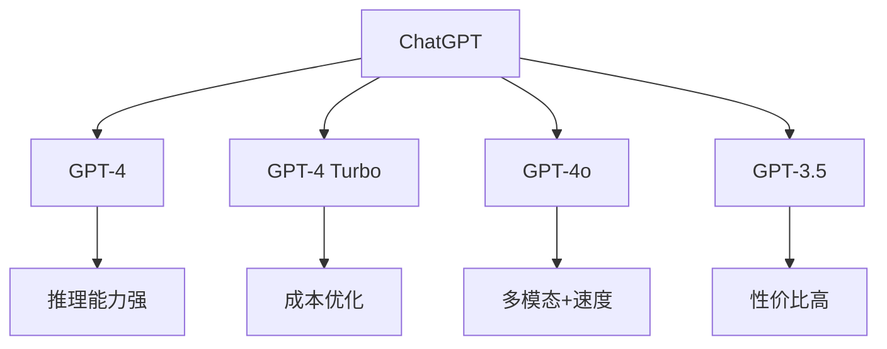
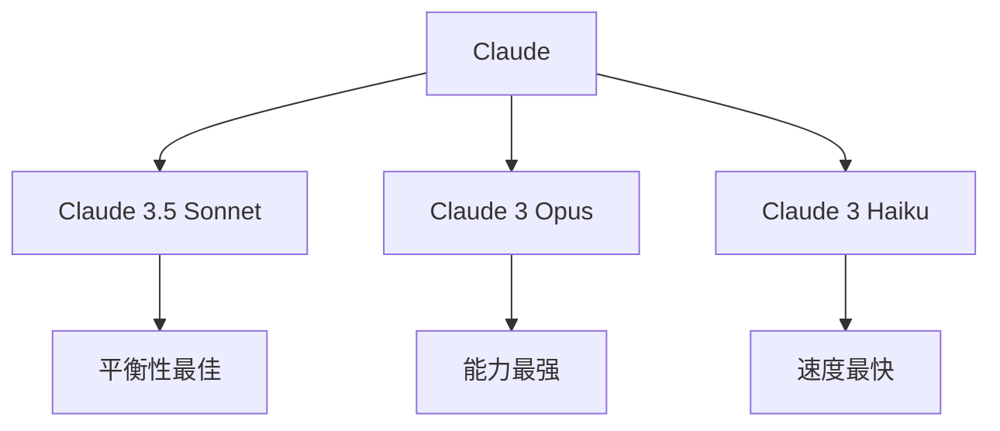
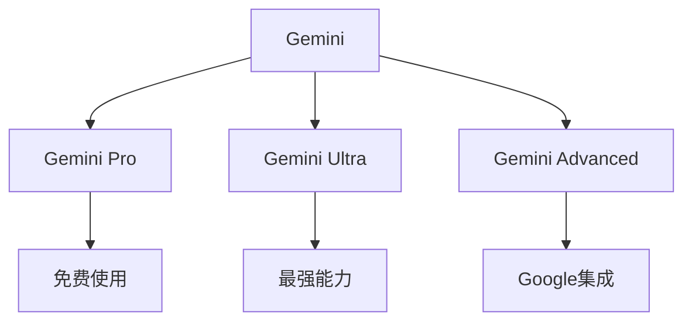
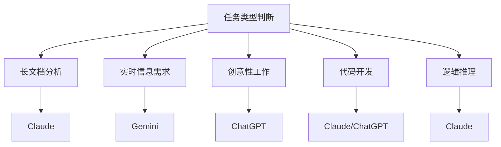

# AI助手对比分析与选择指南

**更新时间**: 2025-08-17  
**涵盖模型**: ChatGPT, Claude, Gemini, 其他主流AI  
**标签**: #AI对比 #工具选择 #效率优化 #最佳实践  
**实用性**: ⭐⭐⭐⭐⭐

---

## 🎯 AI助手全景对比

### 核心能力矩阵
| 能力维度 | ChatGPT | Claude | Gemini | GPT-4o | 其他 |
|----------|---------|---------|---------|---------|------|
| **文本处理** | ⭐⭐⭐⭐⭐ | ⭐⭐⭐⭐⭐ | ⭐⭐⭐⭐ | ⭐⭐⭐⭐⭐ | ⭐⭐⭐ |
| **代码能力** | ⭐⭐⭐⭐ | ⭐⭐⭐⭐⭐ | ⭐⭐⭐⭐ | ⭐⭐⭐⭐⭐ | ⭐⭐⭐ |
| **推理分析** | ⭐⭐⭐⭐ | ⭐⭐⭐⭐⭐ | ⭐⭐⭐⭐ | ⭐⭐⭐⭐ | ⭐⭐⭐ |
| **创意性** | ⭐⭐⭐⭐⭐ | ⭐⭐⭐⭐ | ⭐⭐⭐⭐ | ⭐⭐⭐⭐⭐ | ⭐⭐⭐ |
| **长文本** | ⭐⭐⭐ | ⭐⭐⭐⭐⭐ | ⭐⭐⭐ | ⭐⭐⭐⭐ | ⭐⭐ |
| **多模态** | ⭐⭐⭐⭐ | ⭐⭐⭐ | ⭐⭐⭐⭐⭐ | ⭐⭐⭐⭐⭐ | ⭐⭐ |
| **实时信息** | ❌ | ❌ | ✅ | ✅ | ✅ |
| **安全性** | ⭐⭐⭐⭐ | ⭐⭐⭐⭐⭐ | ⭐⭐⭐⭐ | ⭐⭐⭐⭐ | ⭐⭐⭐ |

## 🔍 详细特性分析

### ChatGPT系列


**优势**:
- 🎨 **创意表现**: 文案写作、头脑风暴、故事创作
- 🌐 **生态丰富**: 插件系统、第三方集成
- 👥 **用户友好**: 界面简洁、学习成本低
- 📊 **数据分析**: Code Interpreter功能强大

**劣势**:
- 📅 **信息滞后**: 训练数据截止较早
- 📝 **长文本限制**: 32K tokens相对较少
- 💰 **成本考虑**: 高级功能需付费

**最适用场景**:
- 创意写作和营销文案
- 快速原型开发
- 教育和学习辅助
- 数据分析和可视化

### Claude系列


**优势**:
- 📚 **长文档处理**: 200K tokens上下文
- 🧠 **逻辑推理**: 复杂问题分析能力强
- 🛡️ **安全可靠**: Constitutional AI训练
- 💻 **代码质量**: 编程任务表现优秀

**劣势**:
- 🌐 **实时信息**: 无法获取最新信息
- 🎨 **创意相对保守**: 创意性略逊于GPT
- 📱 **生态较小**: 第三方集成相对较少

**最适用场景**:
- 长文档分析和总结
- 复杂逻辑推理任务
- 代码审查和重构
- 学术研究和分析

### Gemini系列


**优势**:
- 🌍 **实时信息**: 联网搜索功能
- 🎭 **多模态**: 图像、音频、视频处理
- 🔗 **Google生态**: 与Gmail、Drive等集成
- ⚡ **代码执行**: 实时运行Python代码

**劣势**:
- 🈳 **中文表现**: 中文理解相对较弱
- 🎯 **一致性**: 输出质量波动较大
- 🔒 **隐私考虑**: 与Google服务绑定

**最适用场景**:
- 需要实时信息的任务
- 多模态内容处理
- Google工作流集成
- 数据分析和可视化

## 🛠️ 使用场景匹配指南

### 编程开发任务
```markdown
## 代码相关任务推荐

### 代码审查和重构
🏆 **首选**: Claude 3.5 Sonnet
- 逻辑清晰，分析深入
- 提供具体改进建议
- 代码质量评估准确

### 快速原型开发
🏆 **首选**: ChatGPT-4o
- 创意性强，思路开阔
- 快速生成可用代码
- 迭代开发效率高

### 复杂算法实现
🏆 **首选**: Claude 3 Opus
- 数学推理能力强
- 算法逻辑清晰
- 边界条件考虑周全

### 数据分析代码
🏆 **首选**: Gemini Pro (有数据执行需求)
🥈 **备选**: ChatGPT (Code Interpreter)
- 实时代码执行
- 数据可视化
- 结果验证便利
```

### 内容创作任务
```markdown
## 写作任务最佳选择

### 营销文案创作
🏆 **首选**: ChatGPT-4
- 创意性表现优秀
- 语言风格多样
- 品牌调性把握准确

### 技术文档编写
🏆 **首选**: Claude 3.5 Sonnet
- 逻辑结构清晰
- 技术准确性高
- 可读性好

### 学术论文辅助
🏆 **首选**: Claude 3 Opus
- 分析深度足够
- 逻辑严谨
- 引用准确

### 多语言内容
🏆 **首选**: Gemini Advanced
- 实时翻译验证
- 多文化背景理解
- 本地化建议
```

### 研究分析任务
```markdown
## 分析任务工具选择

### 长文档分析
🏆 **首选**: Claude 3.5 Sonnet (200K context)
- 一次性处理完整文档
- 保持上下文连贯性
- 深度分析能力强

### 实时信息研究
🏆 **首选**: Gemini Advanced
- 联网搜索最新信息
- 多源信息整合
- 实时数据获取

### 复杂逻辑推理
🏆 **首选**: Claude 3 Opus
- 多步推理能力
- 因果关系分析
- 假设验证

### 创意思维激发
🏆 **首选**: ChatGPT-4
- 发散思维强
- 创新想法丰富
- 角度多样化
```

## 💰 成本效益分析

### 价格对比 (2025年8月)
| 服务 | 免费额度 | 付费价格 | 性价比评估 |
|------|----------|----------|------------|
| **ChatGPT** | GPT-3.5无限 | $20/月 Plus | ⭐⭐⭐⭐ |
| **Claude** | 有限制额度 | $20/月 Pro | ⭐⭐⭐⭐⭐ |
| **Gemini** | 基础功能免费 | $20/月 Advanced | ⭐⭐⭐⭐ |
| **API使用** | 按量计费 | 差异较大 | ⭐⭐⭐ |

### 成本优化策略
```markdown
## 多工具组合使用策略

### 基础配置 (月成本: $20)
- **主力**: Claude Pro (深度分析)
- **辅助**: Gemini免费版 (实时信息)
- **特殊**: ChatGPT免费版 (创意头脑风暴)

### 专业配置 (月成本: $40)
- **Claude Pro**: 复杂分析和代码任务
- **ChatGPT Plus**: 创意和数据分析
- **Gemini免费**: 实时信息补充

### 企业配置 (月成本: $60+)
- **全平台订阅**: 不同任务最优选择
- **API集成**: 自动化工作流
- **团队共享**: 成本分摊
```

## 🔄 最佳实践工作流

### 任务分配策略


### 多工具协作流程
```markdown
## 复杂项目处理流程

### 第一步: 信息收集 (Gemini)
- 搜索最新资料
- 收集实时数据
- 了解现状和趋势

### 第二步: 深度分析 (Claude)
- 长文档整合分析
- 逻辑框架构建
- 问题深度剖析

### 第三步: 创意发散 (ChatGPT)
- 解决方案brainstorm
- 创新思路探索
- 多角度思考

### 第四步: 方案整合 (Claude)
- 方案可行性分析
- 逻辑一致性检查
- 最终建议形成

### 第五步: 执行验证 (Gemini)
- 实时数据验证
- 代码执行测试
- 结果反馈调整
```

## 📊 个人使用统计分析

### 我的使用分布
```markdown
## 月度使用统计 (基于个人经验)

### Claude (60% 使用时间)
- 代码审查和重构: 40%
- 长文档分析: 30%
- 技术写作: 20%
- 学习笔记整理: 10%

### ChatGPT (25% 使用时间)
- 创意写作: 50%
- 头脑风暴: 30%
- 快速问答: 20%

### Gemini (15% 使用时间)
- 实时信息查询: 60%
- 多模态处理: 25%
- 数据分析验证: 15%

### 效率提升评估
- 代码质量提升: 40%
- 写作效率提升: 60%
- 学习速度提升: 50%
- 决策质量提升: 30%
```

## 🚀 未来发展趋势

### 技术发展方向
```markdown
## 2025-2026 预期发展

### 能力提升
- **推理能力**: 更复杂的逻辑推理
- **多模态**: 视频、3D、AR/VR支持
- **个性化**: 更好的用户适应性
- **专业化**: 垂直领域深度优化

### 生态整合
- **工具链**: 与开发工具深度集成
- **工作流**: 自动化流程优化
- **协作**: 团队协作功能增强
- **移动端**: 移动设备体验优化

### 商业模式
- **订阅优化**: 更灵活的定价策略
- **企业版**: 专业功能和安全保障
- **API生态**: 更丰富的第三方集成
- **本地化**: 私有部署选项
```

## 📝 选择决策框架

### 决策矩阵
```markdown
## AI助手选择决策表

### 评估维度权重设置
- 任务匹配度: 40%
- 成本效益: 25%
- 易用性: 20%
- 可靠性: 15%

### 个人需求评估
1. **主要工作类型**: [编程/写作/研究/分析]
2. **预算限制**: [免费/低成本/不限]
3. **使用频率**: [偶尔/频繁/重度]
4. **特殊需求**: [实时信息/长文档/多模态]

### 推荐算法
IF 主要是编程 AND 预算充足 THEN Claude Pro
IF 需要创意写作 AND 预算有限 THEN ChatGPT免费版
IF 需要实时信息 THEN Gemini
IF 处理长文档 THEN Claude
```

---

**最后更新**: 2025-08-17  
**评估周期**: 每3个月更新一次  
**使用建议**: 根据具体任务选择最佳工具  
**投资回报**: 🚀🚀🚀🚀🚀 显著提升工作效率