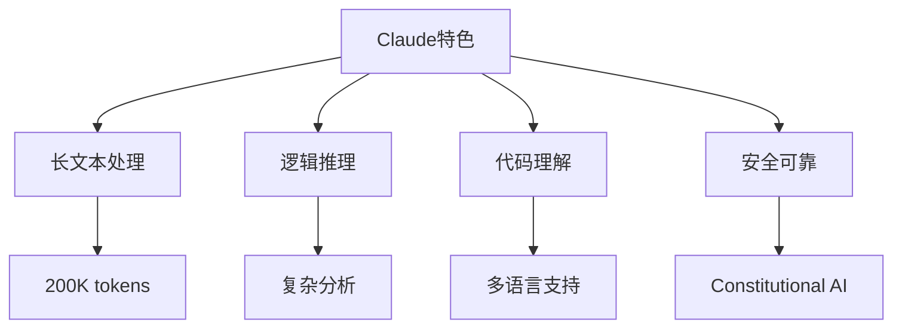

# Claude使用指南与高级技巧

**更新时间**: 2025-08-17  
**适用版本**: Claude 3.5 Sonnet, Claude 3 Opus, Claude 3 Haiku  
**标签**: #Claude #AI助手 #长文本处理 #推理分析  
**熟练度**: ⭐⭐⭐⭐⭐

---

## 🎯 Claude核心优势

### 独特能力矩阵


### 与其他AI的差异化
| 特性   | Claude      | ChatGPT    | Gemini     |
| ---- | ----------- | ---------- | ---------- |
| 文本长度 | 200K tokens | 32K tokens | 32K tokens |
| 推理能力 | ⭐⭐⭐⭐⭐       | ⭐⭐⭐⭐       | ⭐⭐⭐⭐       |
| 代码质量 | ⭐⭐⭐⭐⭐       | ⭐⭐⭐⭐       | ⭐⭐⭐        |
| 安全性  | ⭐⭐⭐⭐⭐       | ⭐⭐⭐⭐       | ⭐⭐⭐⭐       |
| 创意性  | ⭐⭐⭐⭐        | ⭐⭐⭐⭐⭐      | ⭐⭐⭐⭐       |

## 🚀 最佳使用策略

### 1. 长文档分析
```markdown
## 文档分析模板
我需要分析以下长文档，请：

1. **总结概要** (300字以内)
2. **关键信息提取**
   - 主要观点
   - 重要数据
   - 关键结论
3. **结构化分析**
   - 逻辑框架
   - 论证路径
   - 证据支撑
4. **批判性评估**
   - 优势亮点
   - 潜在问题
   - 改进建议

[粘贴长文档内容]
```

### 2. 复杂推理任务
```markdown
## 多步推理模板
问题：[复杂问题描述]

请按以下步骤分析：
1. **问题分解**: 识别子问题和约束条件
2. **信息收集**: 列出已知信息和假设
3. **推理过程**: 展示每步逻辑推导
4. **结果验证**: 检查结论的合理性
5. **不确定性**: 标明不确定的部分

要求：显示完整的思考过程
```

### 3. 代码重构与优化
```markdown
## 代码优化专家
以下代码需要重构，请提供：

**当前代码**:
```python
[粘贴原始代码]
```

**期望改进**:
1. **性能优化**: 时间复杂度和空间优化
2. **可读性**: 变量命名、注释、结构
3. **可维护性**: 模块化、错误处理
4. **最佳实践**: 符合语言规范
5. **测试建议**: 单元测试用例

**输出格式**:
- 重构后代码
- 改进说明
- 性能对比
- 测试代码
```

## 📚 专业领域应用

### 学术研究助手
```markdown
## 研究论文分析
论文标题: [标题]
研究领域: [领域]
分析要求:

1. **研究背景**: 问题背景和研究动机
2. **方法论**: 研究方法和技术路线
3. **创新点**: 主要贡献和创新之处
4. **实验设计**: 实验方案和评估标准
5. **结果分析**: 数据解释和结论推导
6. **局限性**: 研究限制和未来方向
7. **影响评估**: 学术价值和应用前景

[粘贴论文内容或摘要]
```

### 技术文档写作
```markdown
## 技术规范制定
项目: [项目名称]
技术栈: [技术列表]
目标受众: [开发者级别]

请制定包含以下内容的技术规范:

1. **架构设计**
   - 系统架构图
   - 模块职责划分
   - 接口定义

2. **编码规范**
   - 命名约定
   - 代码风格
   - 注释标准

3. **最佳实践**
   - 性能优化指南
   - 安全编码规则
   - 错误处理策略

4. **质量保证**
   - 代码审查流程
   - 测试策略
   - CI/CD流程
```

### 商业分析
```markdown
## 市场分析框架
行业: [具体行业]
分析维度:

1. **市场规模**: SWOT分析
2. **竞争格局**: 波特五力模型
3. **用户画像**: 需求分析
4. **趋势预测**: 技术和市场发展
5. **机会识别**: 蓝海市场机会
6. **风险评估**: 潜在挑战和威胁
7. **策略建议**: 进入策略和定位

请基于公开信息进行分析，并标明信息来源的时效性。
```

## 🔧 高级功能技巧

### 1. 多轮对话管理
```markdown
## 项目追踪模板
项目名称: [项目]
会话目标: [本次讨论目标]
上次进展: [简要回顾]

本次重点:
- [ ] 议题1
- [ ] 议题2
- [ ] 议题3

请在回答中:
1. 参考上次讨论内容
2. 记录本次决策要点
3. 提出下次讨论议题
```

### 2. 结构化输出
```markdown
请使用以下JSON结构输出分析结果:

{
  "executive_summary": "执行摘要",
  "key_findings": [
    {
      "finding": "发现描述",
      "evidence": "支持证据",
      "confidence": "high/medium/low"
    }
  ],
  "recommendations": [
    {
      "action": "具体行动",
      "priority": "高/中/低",
      "timeline": "时间框架",
      "resources": "所需资源"
    }
  ],
  "risks": ["风险1", "风险2"],
  "next_steps": ["下一步1", "下一步2"]
}
```

### 3. 思维模型应用
```markdown
## 系统思维分析
问题: [复杂系统问题]

请运用系统思维分析:

1. **系统要素识别**
   - 关键参与者
   - 重要流程
   - 核心资源

2. **关系网络分析**
   - 因果关系链
   - 反馈回路
   - 杠杆点识别

3. **动态演化**
   - 短期影响
   - 长期趋势
   - 意外后果

4. **干预策略**
   - 高杠杆干预点
   - 实施路径
   - 效果监测
```

## 🎨 创意与内容生成

### 深度内容创作
```markdown
## 长篇内容创作
主题: [内容主题]
目标受众: [读者群体]
内容长度: [目标字数]
风格要求: [写作风格]

创作要求:
1. **内容深度**: 提供独特见解和深度分析
2. **结构完整**: 清晰的逻辑框架
3. **论证严密**: 有说服力的论据支撑
4. **可读性强**: 适合目标受众的语言风格
5. **价值导向**: 为读者提供实用价值

请分段创作，每段包含:
- 段落主题
- 核心观点
- 支撑材料
- 过渡衔接
```

### 创意问题解决
```markdown
## 创新思维激发
挑战: [具体挑战描述]
约束条件: [限制因素]

请运用以下创新方法:

1. **逆向思维**: 反向分析问题
2. **类比思维**: 寻找相似情况的解决方案
3. **组合创新**: 结合不同领域的思路
4. **极限思维**: 考虑极端情况下的解决方案
5. **用户视角**: 从不同用户角度思考

输出:
- 10个创新想法
- 每个想法的可行性分析
- 最佳方案推荐
- 实施路线图
```

## 📊 工作流程优化

### 1. 项目规划助手
```markdown
## 项目规划模板
项目名称: [项目]
项目目标: [SMART目标]
时间限制: [时间框架]
资源约束: [人力、预算、技术]

请制定详细规划:

1. **WBS工作分解**
   - 主要阶段
   - 具体任务
   - 交付物

2. **时间安排**
   - 关键路径分析
   - 里程碑设置
   - 缓冲时间

3. **风险管理**
   - 风险识别
   - 影响评估
   - 应对策略

4. **质量控制**
   - 质量标准
   - 检查节点
   - 改进机制
```

### 2. 决策支持系统
```markdown
## 决策分析框架
决策情境: [描述决策问题]
候选方案: [列出所有选项]
评估维度: [重要因素]

分析要求:
1. **多维度评估矩阵**
2. **权重分配建议**
3. **敏感性分析**
4. **情景分析** (最好/最坏/最可能情况)
5. **推荐决策** (含理由)

输出格式:
- 评估矩阵表格
- 量化分析结果
- 定性分析补充
- 实施建议
```

## ⚡ 效率提升技巧

### 快速响应模式
```markdown
## 快速咨询模板
问题类型: [技术/商业/学术/创意]
紧急程度: [高/中/低]
背景信息: [简要描述]
具体问题: [明确问题]

期望输出:
- 直接答案 (30秒内理解)
- 关键要点 (3-5条)
- 后续建议 (如需深入)

请优先给出实用性强的回答。
```

### 批量处理
```markdown
## 批量任务处理
任务类型: [数据分析/文本处理/代码审查等]
数据源: [数据描述]

处理要求:
1. 统一的处理标准
2. 一致的输出格式
3. 质量检查机制
4. 异常情况处理

请先处理示例数据，确认流程后批量执行。
```

## 🔒 安全与隐私

### 敏感信息处理
```markdown
⚠️ 隐私保护原则:

1. **去识别化**: 移除个人识别信息
2. **数据脱敏**: 替换敏感数据
3. **范围限制**: 仅处理必要信息
4. **用途声明**: 明确数据使用目的

示例:
原文: "张三的手机号是13812345678"
处理: "用户A的手机号是138****5678"
```

### 内容审核标准
- 遵循Constitutional AI原则
- 避免有害、非法内容
- 保护知识产权
- 维护道德伦理标准

## 🔗 工具集成

### API使用技巧
```python
# Claude API调用示例
import anthropic

client = anthropic.Anthropic(api_key="your-api-key")

def claude_analysis(text, analysis_type="summary"):
    prompts = {
        "summary": f"请总结以下内容的要点:\n\n{text}",
        "analysis": f"请深度分析以下内容:\n\n{text}",
        "critique": f"请批判性评估以下内容:\n\n{text}"
    }
    
    response = client.messages.create(
        model="claude-3-5-sonnet-20241022",
        max_tokens=4000,
        messages=[
            {"role": "user", "content": prompts[analysis_type]}
        ]
    )
    
    return response.content[0].text
```

## 📈 使用统计与反思

### 个人使用模式
1. **深度分析**: 40% - 复杂文档和数据分析
2. **代码工作**: 30% - 代码审查和重构
3. **写作助手**: 20% - 技术文档和报告
4. **学习研究**: 10% - 学术材料分析

### 最佳实践总结
- **明确目标**: 清晰描述期望结果
- **提供上下文**: 充分的背景信息
- **分步骤执行**: 复杂任务拆解
- **迭代优化**: 根据结果调整提示
- **质量检查**: 验证重要输出的准确性

---

**最后更新**: 2025-08-17  
**版本**: Claude 3.5 Sonnet  
**掌握程度**: 🧠🧠🧠🧠🧠 深度使用