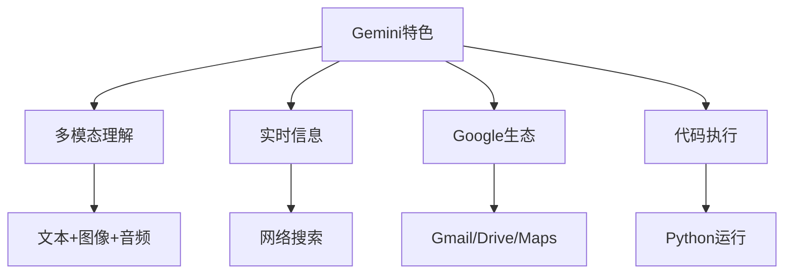

# Gemini使用技巧与特色功能

**更新时间**: 2025-08-17  
**适用版本**: Gemini Pro, Gemini Ultra, Gemini Advanced  
**标签**: #Gemini #多模态AI #Google #实时信息  
**熟练度**: ⭐⭐⭐⭐⚪

---

## 🌟 Gemini核心特色

### 多模态能力矩阵


### 版本对比
| 功能 | Gemini Pro | Gemini Ultra | Gemini Advanced |
|------|------------|--------------|-----------------|
| 多模态 | ⭐⭐⭐ | ⭐⭐⭐⭐⭐ | ⭐⭐⭐⭐⭐ |
| 推理能力 | ⭐⭐⭐⭐ | ⭐⭐⭐⭐⭐ | ⭐⭐⭐⭐⭐ |
| 上下文长度 | 32K | 128K | 128K |
| 实时搜索 | ✅ | ✅ | ✅ |
| 代码执行 | ❌ | ✅ | ✅ |
| Google服务 | 基础 | 完整 | 完整 |

## 🎯 核心使用策略

### 1. 多模态内容分析
```markdown
## 图文混合分析模板
我上传了[图片类型]，请进行多维度分析：

**视觉分析**:
1. 图像内容描述
2. 关键元素识别
3. 视觉风格特点
4. 色彩和构图分析

**深度理解**:
1. 图像背后的含义
2. 文化或专业背景
3. 潜在问题或机会
4. 改进建议

**实用输出**:
- 标签化描述
- 结构化数据提取
- 可操作的建议

[上传图片]
```

### 2. 实时信息查询
```markdown
## 实时信息搜索模板
查询主题: [具体主题]
信息需求:
1. **最新动态**: 近期重要事件和变化
2. **数据更新**: 最新统计数据和指标
3. **趋势分析**: 发展趋势和预测
4. **相关新闻**: 权威来源的新闻报道
5. **专家观点**: 行业专家的最新观点

请提供:
- 信息来源和时间
- 可靠性评估
- 关键数据摘要
- 影响分析
```

### 3. Google服务集成
```markdown
## Gmail智能处理
任务: 邮件分析和回复建议

1. **邮件分类**: 按重要性和类型分类
2. **关键信息提取**: 
   - 发件人信息
   - 核心需求
   - 截止时间
   - 行动项
3. **回复建议**:
   - 回复模板
   - 关键要点
   - 语调建议
4. **后续行动**:
   - 日历安排
   - 任务提醒
   - 文档创建
```

## 📊 专业应用场景

### 数据分析与可视化
```markdown
## 数据分析工作流
数据源: [描述数据]
分析目标: [具体目标]

**第一步: 数据探索**
```python
# 请生成数据探索代码
import pandas as pd
import matplotlib.pyplot as plt
import seaborn as sns

# 数据加载和基础统计
df = pd.read_csv('data.csv')
print(df.info())
print(df.describe())

# 缺失值分析
print(df.isnull().sum())
```

**第二步: 可视化分析**
- 分布图
- 相关性矩阵
- 趋势图
- 异常值检测

**第三步: 统计分析**
- 假设检验
- 回归分析
- 聚类分析

请运行代码并解释结果。
```

### 研究与学习助手
```markdown
## 学术研究模板
研究主题: [主题]
研究深度: [入门/进阶/专业]

**研究框架**:
1. **背景调研**: 
   - 最新文献搜索
   - 研究现状分析
   - 知识图谱构建

2. **深度分析**:
   - 核心概念解释
   - 理论框架梳理
   - 方法论比较

3. **前沿动态**:
   - 最新研究进展
   - 技术发展趋势
   - 应用案例分析

4. **学习路径**:
   - 基础知识清单
   - 进阶学习建议
   - 实践项目推荐

请结合最新信息和经典理论。
```

### 创意设计辅助
```markdown
## 设计创意生成
项目类型: [网站/APP/品牌/产品]
目标用户: [用户画像]
设计风格: [现代/经典/极简等]

**创意发散**:
1. **视觉风格探索**
   - 色彩方案(5套)
   - 字体搭配
   - 布局样式
   - 图标风格

2. **用户体验设计**
   - 用户旅程分析
   - 交互流程图
   - 界面原型图
   - 可用性建议

3. **技术实现**
   - 前端框架选择
   - 响应式设计
   - 性能优化
   - 无障碍访问

请提供具体的设计代码示例。
```

## 🔧 高级功能应用

### 1. 代码执行与调试
```markdown
## 实时代码测试
任务: [编程任务描述]
语言: Python/JavaScript/其他

**开发流程**:
1. **需求分析**: 理解问题和约束
2. **算法设计**: 选择合适的解决方案
3. **代码实现**: 编写可执行代码
4. **测试验证**: 运行测试用例
5. **优化改进**: 性能和代码质量优化

```python
# 请直接运行以下代码并显示结果
def solve_problem(input_data):
    # 实现算法逻辑
    pass

# 测试用例
test_cases = [
    # 添加测试数据
]

for i, test in enumerate(test_cases):
    result = solve_problem(test)
    print(f"Test {i+1}: {result}")
```

**要求**: 显示代码执行结果和性能分析
```

### 2. 多语言处理
```markdown
## 国际化内容处理
源语言: [语言]
目标语言: [语言列表]
内容类型: [技术文档/营销文案/用户界面]

**翻译要求**:
1. **准确性**: 专业术语正确翻译
2. **本地化**: 符合目标文化习惯
3. **一致性**: 术语统一使用
4. **可读性**: 自然流畅的表达

**输出格式**:
| 原文 | 中文 | 英文 | 日文 | 备注 |
|------|------|------|------|------|
| 术语1 | 翻译1 | Translation1 | 翻訳1 | 说明 |

**质量检查**:
- 文化适应性分析
- 技术准确性验证
- 语言风格一致性
```

### 3. 实时协作
```markdown
## 团队协作模板
项目: [项目名称]
参与者: [团队成员]
协作目标: [具体目标]

**协作流程**:
1. **任务分配**
   - 角色定义
   - 责任划分
   - 时间节点

2. **进度跟踪**
   - 实时状态更新
   - 问题记录
   - 解决方案

3. **成果整合**
   - 工作合并
   - 质量检查
   - 最终交付

**沟通机制**:
- 定期同步会议
- 异步更新机制
- 问题升级流程

请创建共享文档和跟踪表格。
```

## 🎨 创新应用场景

### 智能内容生成
```markdown
## 自动化内容创作
内容类型: [博客/报告/教程/营销材料]
目标受众: [受众描述]
核心主题: [主题列表]

**创作要求**:
1. **内容深度**: 专业性与可读性平衡
2. **SEO优化**: 关键词自然融入
3. **视觉元素**: 图表、图片建议
4. **互动元素**: 问答、练习、案例

**输出结构**:
- 标题优化(3个选项)
- 大纲结构
- 完整内容
- 视觉素材建议
- 推广策略

请结合最新趋势和数据。
```

### 问题诊断专家
```markdown
## 智能故障诊断
系统类型: [技术/业务/组织]
问题描述: [具体症状]
环境信息: [相关背景]

**诊断流程**:
1. **症状分析**
   - 问题分类
   - 严重程度评估
   - 影响范围确定

2. **根因分析**
   - 可能原因列表
   - 概率排序
   - 验证方法

3. **解决方案**
   - 应急措施
   - 长期解决方案
   - 预防措施

4. **实施计划**
   - 步骤分解
   - 风险评估
   - 监控机制

请结合实时信息搜索相关案例。
```

## 📱 移动端优化

### 语音交互技巧
```markdown
## 语音助手模式
使用场景: [开车/运动/多任务]
交互方式: 语音输入+输出

**优化策略**:
1. **简洁表达**: 关键信息优先
2. **结构化输出**: 分点清晰表述
3. **可操作指令**: 具体行动建议
4. **上下文记忆**: 连续对话支持

**示例对话**:
用户: "帮我分析这个市场报告的要点"
助手: "好的，我会从以下几个维度分析：
第一，市场规模和增长趋势
第二，主要竞争者及其优势
第三，机会和威胁分析
第四，投资建议
请上传报告，我开始分析..."
```

## ⚡ 效率工具集

### 1. 自动化工作流
```markdown
## Google Workspace集成
任务: 自动化日常工作

**Gmail自动化**:
- 智能分类和标签
- 自动回复生成
- 会议邀请处理
- 重要邮件提醒

**Calendar优化**:
- 智能会议安排
- 冲突检测和解决
- 议程自动生成
- 会后总结创建

**Drive管理**:
- 文件智能分类
- 内容搜索和摘要
- 协作权限优化
- 版本控制辅助

**Sheets分析**:
- 数据自动清洗
- 图表生成建议
- 趋势分析报告
- 预测模型构建
```

### 2. 学习助手系统
```markdown
## 个性化学习计划
学习目标: [具体技能/知识]
当前水平: [基础/中级/高级]
可用时间: [每日/每周时间]
学习偏好: [视频/文字/实践]

**学习路径设计**:
1. **能力评估**
   - 现状测试
   - 差距分析
   - 优先级排序

2. **内容规划**
   - 知识点拆解
   - 难度递进
   - 实践项目

3. **进度跟踪**
   - 学习记录
   - 效果评估
   - 调整优化

4. **资源整合**
   - 最新材料推荐
   - 专家观点收集
   - 同行交流机会

请创建互动式学习计划。
```

## 🔒 隐私与安全

### 数据保护策略
```markdown
⚠️ Gemini使用安全指南:

1. **Google账户安全**
   - 开启两步验证
   - 定期检查活动记录
   - 管理第三方应用权限

2. **对话隐私**
   - 避免敏感个人信息
   - 使用匿名化数据
   - 定期清理历史记录

3. **工作数据保护**
   - 企业版vs个人版区别
   - 数据存储位置了解
   - 合规要求遵循

4. **最佳实践**
   - 最小化信息原则
   - 定期权限审查
   - 数据备份策略
```

## 📈 使用效果评估

### 个人使用统计
1. **信息查询**: 35% - 实时信息和研究
2. **代码开发**: 25% - 编程和调试  
3. **内容创作**: 20% - 写作和设计
4. **数据分析**: 15% - 表格和图表处理
5. **多模态任务**: 5% - 图像和语音处理

### 优势总结
- **实时性**: 获取最新信息和数据
- **集成性**: 与Google服务深度整合
- **多模态**: 处理多种类型的输入
- **执行力**: 代码运行和实时计算
- **协作性**: 团队工作流程优化

### 改进建议
- 加强中文理解和表达
- 优化代码执行稳定性
- 增强创意性思维
- 提升专业领域深度

---

**最后更新**: 2025-08-17  
**版本**: Gemini Pro 1.5  
**掌握程度**: 🚀🚀🚀🚀⚪ 进阶使用