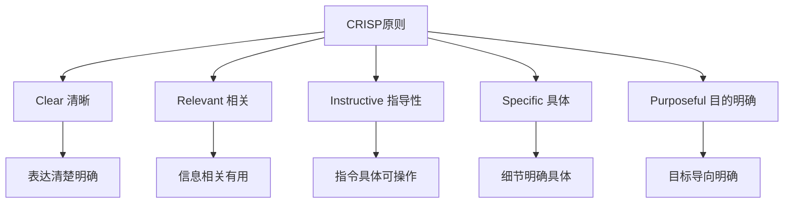

# 提示工程最佳实践指南

**更新时间**: 2025-08-17  
**适用范围**: ChatGPT, Claude, Gemini及其他大语言模型  
**标签**: #提示工程 #Prompt工程 #AI效率 #最佳实践  
**掌握程度**: ⭐⭐⭐⭐⭐

---

## 🎯 提示工程核心原则

### CRISP原则


### 提示结构模板
```markdown
## 标准提示结构

### 1. 角色设定 (Role)
你是一位[专业角色]，拥有[相关经验/背景]。

### 2. 任务描述 (Task)
我需要你帮我[具体任务]，要求[质量标准]。

### 3. 上下文信息 (Context)
背景信息：[相关背景]
约束条件：[限制因素]
目标受众：[目标用户]

### 4. 输出格式 (Format)
请按照以下格式输出：
- [格式要求1]
- [格式要求2]
- [格式要求3]

### 5. 示例参考 (Examples)
输入示例：[示例输入]
期望输出：[示例输出]
```

## 🛠️ 高级提示技巧

### 1. 思维链提示 (Chain of Thought)
```markdown
## CoT提示模板

### 基础版本
请一步步思考这个问题：
1. 首先分析[步骤1]
2. 然后考虑[步骤2]  
3. 接着评估[步骤3]
4. 最后得出[结论]

### 高级版本
让我们逐步分析这个复杂问题：

**第一步：问题分解**
- 将主问题分解为3-5个子问题
- 识别每个子问题的关键要素
- 确定解决顺序和依赖关系

**第二步：信息收集**
- 列出已知信息
- 识别未知信息
- 确定假设条件

**第三步：逻辑推理**
- 对每个子问题进行分析
- 展示推理过程
- 验证中间结果

**第四步：综合结论**
- 整合各部分结果
- 检查逻辑一致性
- 得出最终答案

请在回答中清晰展示每个步骤的思考过程。
```

### 2. 少样本学习 (Few-Shot Learning)
```markdown
## Few-Shot提示设计

### 任务：情感分析
以下是一些情感分析的示例：

示例1:
输入："今天天气真好，心情特别愉快！"
输出：{"sentiment": "positive", "confidence": 0.9, "keywords": ["天气好", "愉快"]}

示例2:
输入："工作压力太大了，感觉很疲惫。"
输出：{"sentiment": "negative", "confidence": 0.8, "keywords": ["压力大", "疲惫"]}

示例3:
输入："这个产品还可以，没什么特别的。"
输出：{"sentiment": "neutral", "confidence": 0.7, "keywords": ["还可以", "没什么特别"]}

现在请分析以下文本：
输入："[待分析文本]"
输出：
```

### 3. 角色扮演提示
```markdown
## 专家角色提示库

### 技术专家
你是一位资深的[技术领域]专家，拥有15年以上的行业经验。你的特点是：
- 深入理解技术原理和最佳实践
- 能够将复杂概念简单化解释
- 关注实际应用和性能优化
- 熟悉行业标准和发展趋势

请以这个角色的身份来回答问题，保持专业性和实用性。

### 创意顾问
你是一位经验丰富的创意总监，曾为多家知名品牌提供创意策略。你的特长包括：
- 敏锐的市场洞察力
- 跨界思维和创新能力
- 品牌故事构建
- 消费者心理分析

请从创意专业角度提供建议，注重原创性和市场价值。

### 商业分析师
你是一位资深商业分析师，专门从事战略规划和市场研究。你的核心能力：
- 数据驱动的决策分析
- 市场趋势预测
- 风险评估和机会识别
- 商业模式设计

请用结构化的商业思维来分析问题。
```

### 4. 约束条件设置
```markdown
## 约束条件模板

### 输出约束
- **长度限制**：回答控制在[X]字以内
- **格式要求**：使用[JSON/表格/列表]格式
- **语言风格**：保持[正式/非正式/技术]语调
- **结构要求**：包含[摘要/详细分析/建议]三部分

### 内容约束  
- **准确性**：基于可靠信息，避免推测
- **相关性**：紧扣主题，避免偏离
- **完整性**：涵盖所有重要方面
- **时效性**：考虑信息的时间相关性

### 质量约束
- **逻辑性**：确保推理过程清晰
- **可操作性**：提供具体可执行的建议
- **客观性**：避免主观偏见
- **实用性**：关注实际应用价值
```

## 📊 不同任务的提示策略

### 分析类任务
```markdown
## 深度分析提示模板

### SWOT分析
请对[分析对象]进行全面的SWOT分析：

**Strengths (优势)**
- 内部优势因素分析
- 竞争优势识别
- 资源能力评估

**Weaknesses (劣势)**  
- 内部限制因素
- 能力短板识别
- 改进空间分析

**Opportunities (机会)**
- 外部有利因素
- 市场机会识别
- 发展趋势把握

**Threats (威胁)**
- 外部不利因素
- 潜在风险识别
- 竞争威胁分析

请为每个维度提供3-5个要点，并给出战略建议。
```

### 创意类任务
```markdown
## 创意激发提示策略

### 头脑风暴模板
主题：[创意主题]
目标：[期望达成的目标]

请运用以下创意思维方法：

**1. 发散思维**
- 提供10个不同角度的创意想法
- 不受现有框架限制
- 鼓励大胆和创新的思路

**2. 联想思维**
- 从相关领域寻找灵感
- 跨界组合不同元素
- 类比和隐喻的运用

**3. 逆向思维**
- 反向思考问题
- 挑战常规假设
- 探索非主流方案

**4. 场景思维**
- 构建具体使用场景
- 考虑用户体验
- 情境化的解决方案

请为每个想法提供简要说明和可行性评估。
```

### 问题解决类任务
```markdown
## 问题解决框架

### 5W1H分析法
问题：[具体问题描述]

**What (什么)**
- 问题的具体表现是什么？
- 影响了什么方面？
- 预期的结果是什么？

**Why (为什么)**
- 问题产生的根本原因？
- 为什么现在发生？
- 为什么之前没有？

**Who (谁)**
- 涉及哪些人或组织？
- 谁受到影响？
- 谁有解决的能力？

**When (何时)**
- 问题什么时候开始？
- 解决的时间要求？
- 关键时间节点？

**Where (何地)**
- 问题出现在哪里？
- 影响范围有多大？
- 相关的环境因素？

**How (如何)**
- 如何解决这个问题？
- 需要什么资源？
- 具体的执行步骤？

请基于这个框架进行系统性分析。
```

## 🎨 专业领域提示模板

### 编程相关
```markdown
## 代码任务提示模板

### 代码审查
请对以下代码进行全面审查：

**代码片段：**
```[language]
[代码内容]
```

**审查维度：**
1. **功能正确性**
   - 逻辑是否正确
   - 边界条件处理
   - 异常情况考虑

2. **代码质量**
   - 可读性和维护性
   - 命名规范
   - 注释完整性

3. **性能优化**
   - 时间复杂度分析
   - 空间复杂度评估
   - 优化建议

4. **安全性**
   - 潜在安全风险
   - 数据验证
   - 权限控制

5. **最佳实践**
   - 设计模式应用
   - 代码复用
   - 测试覆盖

**输出格式：**
- 问题清单（按优先级排序）
- 具体改进建议
- 重构后的代码示例
```

### 商业分析
```markdown
## 商业策略分析模板

### 市场进入策略
分析对象：[目标市场/产品]

**1. 市场环境分析**
- 市场规模和增长趋势
- 竞争格局分析
- 行业发展阶段
- 监管环境评估

**2. 目标客户分析**
- 客户细分
- 需求痛点分析
- 购买决策流程
- 价格敏感度

**3. 竞争优势分析**
- 核心竞争力
- 差异化定位
- 资源禀赋
- 技术壁垒

**4. 进入策略设计**
- 市场切入点
- 产品定位策略
- 渠道策略
- 定价策略

**5. 风险评估**
- 市场风险
- 竞争风险
- 运营风险
- 财务风险

请提供数据支持和具体的行动建议。
```

### 学术研究
```markdown
## 学术分析提示模板

### 文献综述
研究主题：[具体研究主题]
文献范围：[时间范围、数据库、关键词]

**分析结构：**
1. **研究背景**
   - 问题提出的背景
   - 研究意义和价值
   - 理论基础

2. **文献梳理**
   - 按时间线梳理发展脉络
   - 按理论流派分类讨论
   - 关键研究成果总结

3. **方法论分析**
   - 主要研究方法总结
   - 方法优缺点分析
   - 方法论发展趋势

4. **研究空白识别**
   - 现有研究的局限性
   - 理论空白点
   - 方法论创新机会

5. **未来方向**
   - 发展趋势预测
   - 新兴研究方向
   - 跨学科融合机会

**输出要求：**
- 逻辑结构清晰
- 关键文献引用准确
- 批判性思维体现
- 创新性见解突出
```

## ⚡ 效率优化技巧

### 提示复用策略
```markdown
## 模板化管理

### 个人提示库构建
1. **按任务类型分类**
   - 分析类模板
   - 创意类模板
   - 技术类模板
   - 商业类模板

2. **按输出格式分类**
   - JSON格式模板
   - 表格格式模板
   - 报告格式模板
   - 列表格式模板

3. **按专业领域分类**
   - 编程开发
   - 商业分析
   - 学术研究
   - 创意设计

### 模板使用技巧
- 基础模板 + 个性化调整
- 模块化组合使用
- 版本迭代优化
- 效果反馈记录
```

### 提示链技术
```markdown
## 复杂任务分解

### 多步骤提示链
**第一步：信息收集**
提示：请收集关于[主题]的基础信息...

**第二步：深度分析**  
提示：基于上述信息，请进行深度分析...

**第三步：方案设计**
提示：根据分析结果，请设计解决方案...

**第四步：效果评估**
提示：请评估方案的可行性和预期效果...

### 迭代优化流程
1. 初始提示设计
2. 测试输出质量
3. 识别改进点
4. 调整提示参数
5. 再次测试验证
6. 形成最终版本
```

## 🔍 质量评估与优化

### 输出质量评估框架
```markdown
## STAR评估法

### S - Specific (具体性)
- 回答是否针对性强？
- 是否避免了泛泛而谈？
- 细节是否充分？

### T - Timely (时效性)
- 信息是否及时准确？
- 是否考虑了时间因素？
- 预测是否合理？

### A - Actionable (可操作性)
- 建议是否具体可执行？
- 是否提供了实施路径？
- 资源需求是否明确？

### R - Relevant (相关性)
- 内容是否切题？
- 是否满足了用户需求？
- 重点是否突出？

### 评分标准
每个维度1-5分，总分20分
- 18-20分：优秀
- 15-17分：良好  
- 12-14分：一般
- 12分以下：需要改进
```

### 常见问题及解决方案
```markdown
## 提示优化指南

### 问题1：回答过于宽泛
**原因分析：**
- 问题描述不够具体
- 缺乏上下文信息
- 没有明确输出要求

**解决方案：**
- 增加具体的背景信息
- 明确约束条件和要求
- 提供示例参考

### 问题2：逻辑不够清晰
**原因分析：**
- 缺乏结构化思维引导
- 没有明确推理步骤
- 复杂度超过单次处理能力

**解决方案：**
- 使用思维链提示
- 分步骤引导推理
- 复杂任务分解处理

### 问题3：创意性不足
**原因分析：**
- 提示过于保守
- 缺乏创意激发机制
- 约束条件过多

**解决方案：**
- 鼓励发散思维
- 提供多角度思考引导
- 适度放松约束条件
```

---

**最后更新**: 2025-08-17  
**适用版本**: 所有主流大语言模型  
**掌握程度**: 🎯🎯🎯🎯🎯 提示工程专家级