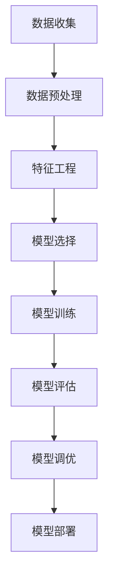

# 《Python机器学习》

**作者**: Sebastian Raschka, Vahid Mirjalili  
**出版年份**: 2019 (第3版)  
**阅读状态**: #已完成  
**标签**: #Python #机器学习实践 #scikit-learn #数据科学  
**评分**: ⭐⭐⭐⭐⭐

---

## 📖 书籍概述

实战导向的机器学习教材，重点介绍如何使用Python生态系统实现机器学习算法。从基础概念到深度学习，代码丰富，适合动手实践。

## 🐍 Python机器学习生态系统

### 核心库介绍
```python
# 数据处理三剑客
import numpy as np          # 数值计算
import pandas as pd         # 数据处理
import matplotlib.pyplot as plt  # 可视化

# 机器学习工具
from sklearn import datasets, model_selection, metrics
import scipy                # 科学计算
import seaborn as sns      # 高级可视化
```

### 深度学习框架
- **TensorFlow/Keras**: Google开源，易用性强
- **PyTorch**: Facebook开源，动态图
- **JAX**: Google新框架，函数式编程

## 🎯 机器学习工作流程

### 典型项目流程


### 数据预处理管道
```python
from sklearn.pipeline import Pipeline
from sklearn.preprocessing import StandardScaler
from sklearn.decomposition import PCA
from sklearn.svm import SVC

# 构建预处理管道
pipe = Pipeline([
    ('scaler', StandardScaler()),
    ('pca', PCA(n_components=2)),
    ('classifier', SVC())
])

# 训练模型
pipe.fit(X_train, y_train)
y_pred = pipe.predict(X_test)
```

## 📝 重要章节要点

### 第3章: 使用scikit-learn进行机器学习
**感知机实现**:
```python
from sklearn.linear_model import Perceptron

# 创建感知机分类器
ppn = Perceptron(eta0=0.1, random_state=1)
ppn.fit(X_train_std, y_train)

# 可视化决策边界
def plot_decision_regions(X, y, classifier):
    # 设置颜色和标记
    markers = ('s', 'x', 'o', '^', 'v')
    colors = ('red', 'blue', 'lightgreen', 'gray', 'cyan')
    cmap = ListedColormap(colors[:len(np.unique(y))])
    
    # 绘制决策区域
    # ... 实现细节
```

### 第4章: 构建良好的训练数据集
**处理缺失数据**:
```python
from sklearn.impute import SimpleImputer

# 均值填充
imr = SimpleImputer(missing_values=np.nan, strategy='mean')
imr = imr.fit(df.values)
imputed_data = imr.transform(df.values)
```

**特征缩放**:
```python
from sklearn.preprocessing import MinMaxScaler, StandardScaler

# 最小-最大归一化
mms = MinMaxScaler()
X_train_norm = mms.fit_transform(X_train)

# 标准化
stdsc = StandardScaler()
X_train_std = stdsc.fit_transform(X_train)
```

### 第5章: 通过降维压缩数据
**主成分分析(PCA)**:
```python
from sklearn.decomposition import PCA

# PCA降维
pca = PCA(n_components=2)
X_train_pca = pca.fit_transform(X_train_std)

# 解释方差比
print('Explained variance ratio:', pca.explained_variance_ratio_)
```

**线性判别分析(LDA)**:
```python
from sklearn.discriminant_analysis import LinearDiscriminantAnalysis

lda = LinearDiscriminantAnalysis(n_components=2)
X_train_lda = lda.fit_transform(X_train_std, y_train)
```

## 🧮 算法实现对比

### 从零实现 vs sklearn实现

**逻辑回归 - 手动实现**:
```python
class LogisticRegressionGD:
    def __init__(self, eta=0.05, n_iter=100, random_state=1):
        self.eta = eta
        self.n_iter = n_iter
        self.random_state = random_state
    
    def fit(self, X, y):
        rgen = np.random.RandomState(self.random_state)
        self.w_ = rgen.normal(loc=0.0, scale=0.01, size=1 + X.shape[1])
        self.cost_ = []
        
        for i in range(self.n_iter):
            net_input = self.net_input(X)
            output = self.activation(net_input)
            errors = (y - output)
            self.w_[1:] += self.eta * X.T.dot(errors)
            self.w_[0] += self.eta * errors.sum()
            
            cost = (-y.dot(np.log(output)) - 
                   ((1 - y).dot(np.log(1 - output))))
            self.cost_.append(cost)
        return self
```

**逻辑回归 - sklearn实现**:
```python
from sklearn.linear_model import LogisticRegression

lr = LogisticRegression(C=100.0, random_state=1, 
                       solver='lbfgs', multi_class='ovr')
lr.fit(X_train_std, y_train)
```

## 📊 模型评估与选择

### 交叉验证策略
```python
from sklearn.model_selection import cross_val_score, StratifiedKFold

# 分层k折交叉验证
skfold = StratifiedKFold(n_splits=10, random_state=1, shuffle=True)
scores = cross_val_score(estimator=pipe, X=X_train, y=y_train, 
                        cv=skfold, scoring='accuracy')

print(f'CV accuracy: {scores.mean():.3f} +/- {scores.std():.3f}')
```

### 超参数调优
```python
from sklearn.model_selection import GridSearchCV

# 网格搜索
param_grid = [
    {'C': [1.0, 10.0, 100.0, 1000.0],
     'kernel': ['linear']},
    {'C': [1.0, 10.0, 100.0, 1000.0],
     'gamma': [0.001, 0.01, 0.1, 1.0],
     'kernel': ['rbf']}
]

gs = GridSearchCV(estimator=SVC(), param_grid=param_grid, 
                 scoring='accuracy', cv=10)
gs = gs.fit(X_train, y_train)
print(f'Best score: {gs.best_score_}')
print(f'Best params: {gs.best_params_}')
```

## 🧠 深度学习章节

### TensorFlow/Keras实现
```python
import tensorflow as tf
from tensorflow import keras

# 构建神经网络
model = keras.Sequential([
    keras.layers.Flatten(input_shape=(28, 28)),
    keras.layers.Dense(128, activation='relu'),
    keras.layers.Dropout(0.2),
    keras.layers.Dense(10, activation='softmax')
])

# 编译模型
model.compile(optimizer='adam',
              loss='sparse_categorical_crossentropy',
              metrics=['accuracy'])

# 训练模型
model.fit(X_train, y_train, 
          epochs=5, 
          validation_data=(X_test, y_test))
```

### 卷积神经网络
```python
# CNN for image classification
cnn_model = keras.Sequential([
    keras.layers.Conv2D(32, (3, 3), activation='relu', 
                       input_shape=(32, 32, 3)),
    keras.layers.MaxPooling2D((2, 2)),
    keras.layers.Conv2D(64, (3, 3), activation='relu'),
    keras.layers.MaxPooling2D((2, 2)),
    keras.layers.Conv2D(64, (3, 3), activation='relu'),
    keras.layers.Flatten(),
    keras.layers.Dense(64, activation='relu'),
    keras.layers.Dense(10, activation='softmax')
])
```

## 🔗 实用技巧总结

### 数据处理最佳实践
1. **缺失值处理**: 根据数据类型选择策略
2. **特征缩放**: 基于距离的算法必须标准化
3. **类别编码**: One-hot vs Label encoding
4. **特征选择**: 过滤法、包装法、嵌入法

### 模型选择指南
| 问题类型 | 数据规模 | 推荐算法 | 特点 |
|----------|----------|----------|------|
| 分类 | 小 | SVM, 随机森林 | 效果好 |
| 分类 | 大 | 逻辑回归, 神经网络 | 可扩展 |
| 回归 | 小 | 随机森林, SVR | 非线性 |
| 回归 | 大 | 线性回归, 深度学习 | 效率高 |

## 🎯 项目实践经验

### 实现的项目
- [x] **鸢尾花分类**: 经典入门项目
- [x] **手写数字识别**: CNN实现
- [x] **情感分析**: 文本分类任务
- [x] **房价预测**: 回归问题实践

### 代码仓库结构
```
ml_project/
├── data/           # 数据文件
├── notebooks/      # Jupyter notebooks
├── src/           # 源代码
│   ├── preprocessing.py
│   ├── models.py
│   └── utils.py
├── tests/         # 单元测试
└── requirements.txt
```

## 💡 学习心得

### 理论与实践结合
1. **先理解再实现**: 了解算法原理后再使用库
2. **对比学习**: 手动实现与库实现对比
3. **可视化重要**: 图表帮助理解算法行为

### 工程化思维
1. **管道化**: 使用Pipeline组织工作流
2. **模块化**: 代码结构清晰，便于维护
3. **版本控制**: Git管理代码和实验

## 📚 配套资源

- **GitHub仓库**: 所有代码示例
- **数据集**: UCI、Kaggle等公开数据
- **在线notebook**: Google Colab运行环境

---

**阅读完成日期**: 2025-03-20  
**实践项目数**: 8个  
**代码行数**: ~2000行  
**推荐程度**: 🐍 Python ML入门首选