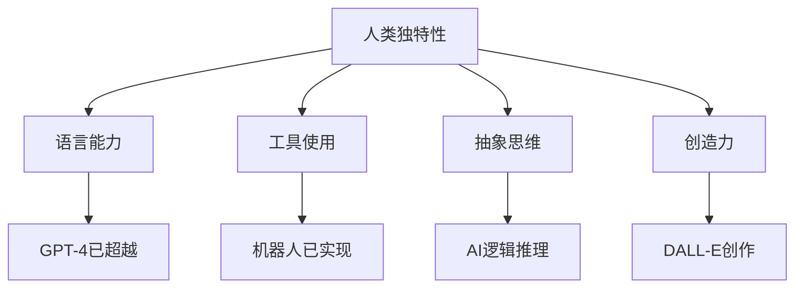

# 《人类简史》与AI的未来思考

**作者**: 尤瓦尔·赫拉利 (Yuval Noah Harari)  
**出版年份**: 2014  
**阅读状态**: #已完成  
**标签**: #历史哲学 #AI伦理 #人类未来 #技术哲学  
**评分**: ⭐⭐⭐⭐⭐

---

## 📖 书籍概述

虽然这不是一本纯粹的AI技术书籍，但赫拉利对人类历史的宏观分析为我们理解AI时代的挑战提供了独特视角。从认知革命到科学革命，再到即将到来的数据革命。

## 🧠 三次革命与AI

### 认知革命 (7万年前)
- **虚构故事的力量**: 人类通过共同信念实现大规模协作
- **AI启示**: 机器学习也在学习人类的"虚构故事"(标签数据)

### 农业革命 (1.2万年前)  
- **专业化分工**: 社会复杂性的增加
- **AI平行**: 深度学习的分层特征学习类似人类社会分工

### 科学革命 (500年前)
- **承认无知**: "我们不知道"成为知识增长的起点
- **AI连接**: 机器学习的本质就是从数据中发现未知模式

## 🤖 AI时代的哲学思考

### 智人的独特性正在消失？



### 数据主义的兴起
> "数据主义认为，宇宙由数据流组成，任何现象或实体的价值就在于对数据处理的贡献"

**AI角度解读**:
- 人类 = 生物算法
- AI = 电子算法  
- 决策依据: 数据处理效率

## 💭 关键概念与AI的关联

### 虚构的秩序
**传统例子**: 金钱、法律、宗教
**AI时代**: 算法推荐、信用评分、社交媒体

### 想象的共同体
- **国家认同** → **平台生态**
- **宗教信仰** → **技术信仰**
- **民族主义** → **数字部落**

## 🔮 未来预测的AI维度

### 1. 无用阶级的产生
```
AI能力提升 → 人类工作被替代 → 大规模失业 → 社会重构
```

**思考题**: 
- 如何重新定义人类价值？
- 全民基本收入是唯一解决方案吗？

### 2. 算法的权威
- **医疗诊断**: AI医生 vs 人类医生
- **法律判决**: 算法量刑 vs 法官自由裁量
- **教育决策**: 个性化AI老师 vs 统一教育

### 3. 数据集中的权力
**新的权力结构**:
```
数据 = 新石油
算法 = 新炼油厂
AI公司 = 新的石油巨头
```

## 📊 AI发展的历史类比

| 历史阶段 | 主要特征 | AI时代对应 |
|----------|----------|------------|
| 狩猎采集 | 小规模协作 | 个人AI助手 |
| 农业社会 | 等级制度 | AI算法权威 |
| 工业革命 | 机器替代体力 | AI替代脑力 |
| 信息时代 | 知识经济 | 数据经济 |

## 🎯 对AI从业者的启示

### 技术伦理思考
1. **算法公平性**: 避免历史偏见的延续
2. **隐私保护**: 数据使用的边界在哪里？
3. **可解释性**: AI决策的透明度要求

### 人文素养的重要性
- **历史视角**: 理解技术变革的规律
- **哲学思辨**: 思考AI对人类意义的影响
- **社会责任**: 技术发展的社会后果

## 🔗 相关思考链接

- [[AI伦理]]
- [[技术哲学]]
- [[算法偏见]]
- [[人机共存]]
- [[未来工作]]

## 💡 个人反思

### 作为AI开发者的思考
1. **技术乐观主义的局限**: 不能只关注技术进步，忽视社会影响
2. **历史责任感**: 我们正在创造影响未来的算法
3. **跨学科视野**: AI发展需要历史、哲学、社会学的综合考量

### 问题清单
- [ ] AI是否会重塑人类对自身的定义？
- [ ] 如何在效率与公平之间找到平衡？
- [ ] 技术奇点是必然还是可能？
- [ ] 人类还有哪些AI无法替代的价值？

## 📚 延伸阅读

1. 《未来简史》- 同作者，直接探讨AI时代
2. 《生命3.0》- Max Tegmark，AI与生命的未来
3. 《人工智能的未来》- Stuart Russell，AI安全问题
4. 《算法霸权》- Cathy O'Neil，算法的社会影响

## 🎬 相关资源

- **TED演讲**: "人工智能的兴起"
- **纪录片**: 《AlphaGo》
- **播客**: Sam Harris的"Making Sense"

---

**阅读完成日期**: 2025-05-10  
**思考深度**: 🧠🧠🧠🧠🧠  
**对AI工作的影响**: 重新审视技术的社会意义