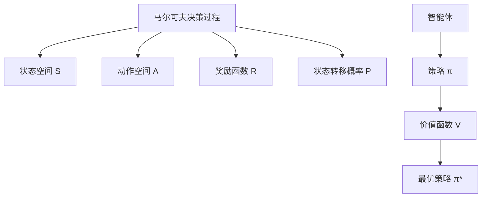

# 《强化学习：原理与Python实现》

**作者**: 肖智清  
**出版年份**: 2019  
**阅读状态**: #正在阅读  
**标签**: #强化学习 #Python实现 #马尔可夫决策过程 #深度强化学习  
**评分**: ⭐⭐⭐⭐⭐

---

## 📖 书籍概述

系统介绍强化学习理论与实践的中文教材，从基础的马尔可夫决策过程到深度强化学习，理论推导详细，Python代码实现完整。

## 🎯 强化学习核心要素

### MDP四元组


### 核心概念
- **状态 (State)**: 环境的完整描述
- **动作 (Action)**: 智能体可执行的操作
- **奖励 (Reward)**: 环境对动作的即时反馈
- **策略 (Policy)**: 状态到动作的映射
- **价值函数**: 状态或状态-动作对的长期价值

## 📝 理论基础深入

### 贝尔曼方程
**状态价值函数**:
$$V^\pi(s) = \mathbb{E}_\pi[G_t | S_t = s] = \mathbb{E}_\pi[R_{t+1} + \gamma V^\pi(S_{t+1}) | S_t = s]$$

**动作价值函数**:
$$Q^\pi(s,a) = \mathbb{E}_\pi[G_t | S_t = s, A_t = a] = \mathbb{E}[R_{t+1} + \gamma Q^\pi(S_{t+1}, A_{t+1}) | S_t = s, A_t = a]$$

**最优性方程**:
$$V^*(s) = \max_a \mathbb{E}[R_{t+1} + \gamma V^*(S_{t+1}) | S_t = s, A_t = a]$$

### Python实现示例
```python
import numpy as np

class MDP:
    def __init__(self, states, actions, rewards, transitions, gamma=0.9):
        self.states = states
        self.actions = actions  
        self.rewards = rewards
        self.transitions = transitions
        self.gamma = gamma
    
    def value_iteration(self, theta=1e-6):
        """价值迭代算法"""
        V = np.zeros(len(self.states))
        
        while True:
            delta = 0
            for s in range(len(self.states)):
                v = V[s]
                # 计算所有动作的期望回报
                action_values = []
                for a in range(len(self.actions)):
                    value = 0
                    for s_next in range(len(self.states)):
                        prob = self.transitions[s][a][s_next]
                        reward = self.rewards[s][a][s_next]
                        value += prob * (reward + self.gamma * V[s_next])
                    action_values.append(value)
                
                V[s] = max(action_values)
                delta = max(delta, abs(v - V[s]))
            
            if delta < theta:
                break
        
        return V
    
    def extract_policy(self, V):
        """从价值函数提取策略"""
        policy = np.zeros(len(self.states), dtype=int)
        
        for s in range(len(self.states)):
            action_values = []
            for a in range(len(self.actions)):
                value = 0
                for s_next in range(len(self.states)):
                    prob = self.transitions[s][a][s_next]
                    reward = self.rewards[s][a][s_next]
                    value += prob * (reward + self.gamma * V[s_next])
                action_values.append(value)
            
            policy[s] = np.argmax(action_values)
        
        return policy
```

## 🧮 经典算法实现

### 时序差分学习 (TD Learning)
**Q-Learning算法**:
```python
class QLearning:
    def __init__(self, n_states, n_actions, lr=0.1, gamma=0.9, epsilon=0.1):
        self.n_states = n_states
        self.n_actions = n_actions
        self.lr = lr
        self.gamma = gamma
        self.epsilon = epsilon
        self.q_table = np.zeros((n_states, n_actions))
    
    def choose_action(self, state):
        """ε-贪婪策略选择动作"""
        if np.random.random() < self.epsilon:
            return np.random.choice(self.n_actions)  # 探索
        else:
            return np.argmax(self.q_table[state])  # 利用
    
    def update(self, state, action, reward, next_state, done):
        """Q值更新"""
        if done:
            target = reward
        else:
            target = reward + self.gamma * np.max(self.q_table[next_state])
        
        self.q_table[state, action] += self.lr * (target - self.q_table[state, action])
    
    def train(self, env, episodes=1000):
        """训练智能体"""
        rewards = []
        
        for episode in range(episodes):
            state = env.reset()
            total_reward = 0
            done = False
            
            while not done:
                action = self.choose_action(state)
                next_state, reward, done = env.step(action)
                self.update(state, action, reward, next_state, done)
                
                state = next_state
                total_reward += reward
            
            rewards.append(total_reward)
        
        return rewards
```

### SARSA算法
```python
class SARSA:
    def __init__(self, n_states, n_actions, lr=0.1, gamma=0.9, epsilon=0.1):
        self.n_states = n_states
        self.n_actions = n_actions  
        self.lr = lr
        self.gamma = gamma
        self.epsilon = epsilon
        self.q_table = np.zeros((n_states, n_actions))
    
    def choose_action(self, state):
        if np.random.random() < self.epsilon:
            return np.random.choice(self.n_actions)
        else:
            return np.argmax(self.q_table[state])
    
    def update(self, state, action, reward, next_state, next_action):
        """SARSA更新规则"""
        target = reward + self.gamma * self.q_table[next_state, next_action]
        self.q_table[state, action] += self.lr * (target - self.q_table[state, action])
```

## 🤖 深度强化学习

### DQN (Deep Q-Network)
```python
import torch
import torch.nn as nn
import torch.optim as optim
import random
from collections import deque

class DQN(nn.Module):
    def __init__(self, input_size, hidden_size, output_size):
        super(DQN, self).__init__()
        self.fc1 = nn.Linear(input_size, hidden_size)
        self.fc2 = nn.Linear(hidden_size, hidden_size)
        self.fc3 = nn.Linear(hidden_size, output_size)
    
    def forward(self, x):
        x = torch.relu(self.fc1(x))
        x = torch.relu(self.fc2(x))
        return self.fc3(x)

class DQNAgent:
    def __init__(self, state_size, action_size, lr=1e-3):
        self.state_size = state_size
        self.action_size = action_size
        self.memory = deque(maxlen=10000)
        self.epsilon = 1.0
        self.epsilon_min = 0.01
        self.epsilon_decay = 0.995
        
        # 神经网络
        self.q_network = DQN(state_size, 64, action_size)
        self.target_network = DQN(state_size, 64, action_size)
        self.optimizer = optim.Adam(self.q_network.parameters(), lr=lr)
        
    def remember(self, state, action, reward, next_state, done):
        self.memory.append((state, action, reward, next_state, done))
    
    def act(self, state):
        if np.random.random() <= self.epsilon:
            return random.choice(range(self.action_size))
        
        state_tensor = torch.FloatTensor(state).unsqueeze(0)
        q_values = self.q_network(state_tensor)
        return np.argmax(q_values.cpu().data.numpy())
    
    def replay(self, batch_size=32):
        if len(self.memory) < batch_size:
            return
        
        batch = random.sample(self.memory, batch_size)
        states = torch.FloatTensor([e[0] for e in batch])
        actions = torch.LongTensor([e[1] for e in batch])
        rewards = torch.FloatTensor([e[2] for e in batch])
        next_states = torch.FloatTensor([e[3] for e in batch])
        dones = torch.BoolTensor([e[4] for e in batch])
        
        current_q_values = self.q_network(states).gather(1, actions.unsqueeze(1))
        next_q_values = self.target_network(next_states).max(1)[0].detach()
        target_q_values = rewards + (0.99 * next_q_values * ~dones)
        
        loss = nn.MSELoss()(current_q_values.squeeze(), target_q_values)
        
        self.optimizer.zero_grad()
        loss.backward()
        self.optimizer.step()
        
        if self.epsilon > self.epsilon_min:
            self.epsilon *= self.epsilon_decay
```

## 🎮 经典环境实践

### GridWorld环境
```python
class GridWorld:
    def __init__(self, size=4):
        self.size = size
        self.reset()
    
    def reset(self):
        self.agent_pos = [0, 0]
        self.goal_pos = [self.size-1, self.size-1]
        return self.get_state()
    
    def get_state(self):
        return self.agent_pos[0] * self.size + self.agent_pos[1]
    
    def step(self, action):
        # 动作: 0=上, 1=下, 2=左, 3=右
        x, y = self.agent_pos
        
        if action == 0 and x > 0:  # 上
            x -= 1
        elif action == 1 and x < self.size - 1:  # 下
            x += 1
        elif action == 2 and y > 0:  # 左
            y -= 1
        elif action == 3 and y < self.size - 1:  # 右
            y += 1
        
        self.agent_pos = [x, y]
        
        # 奖励设计
        if self.agent_pos == self.goal_pos:
            reward = 10
            done = True
        else:
            reward = -1
            done = False
        
        return self.get_state(), reward, done
```

### CartPole平衡杆
```python
def train_cartpole():
    """训练CartPole环境"""
    import gym
    
    env = gym.make('CartPole-v1')
    agent = DQNAgent(state_size=4, action_size=2)
    
    scores = []
    for episode in range(2000):
        state = env.reset()
        total_reward = 0
        
        for time in range(500):
            action = agent.act(state)
            next_state, reward, done, _ = env.step(action)
            agent.remember(state, action, reward, next_state, done)
            
            state = next_state
            total_reward += reward
            
            if done:
                break
        
        scores.append(total_reward)
        agent.replay()
        
        # 更新目标网络
        if episode % 100 == 0:
            agent.target_network.load_state_dict(agent.q_network.state_dict())
        
        if episode % 100 == 0:
            print(f"Episode {episode}, Average Score: {np.mean(scores[-100:])}")
    
    return scores
```

## 📊 算法性能对比

| 算法 | 收敛速度 | 样本效率 | 适用环境 | 实现复杂度 |
|------|----------|----------|----------|------------|
| Q-Learning | 中等 | 中等 | 离散状态 | 简单 |
| SARSA | 中等 | 中等 | 离散状态 | 简单 |
| DQN | 快 | 高 | 连续状态 | 中等 |
| Policy Gradient | 慢 | 低 | 连续动作 | 复杂 |
| Actor-Critic | 中等 | 中等 | 通用 | 复杂 |

## 🔗 相关概念链接

- [[马尔可夫链]]
- [[动态规划]]
- [[蒙特卡洛方法]]
- [[函数逼近]]
- [[策略梯度]]

## 💡 学习心得

### 理论理解
1. **数学基础重要**: 概率论、统计学、优化理论
2. **算法演进脉络**: 从表格方法到函数逼近到深度学习
3. **探索-利用权衡**: RL的核心挑战之一

### 实践经验
1. **环境设计**: 奖励函数的设计至关重要
2. **超参数调优**: 学习率、折扣因子、探索率等
3. **稳定性问题**: 深度RL训练不稳定，需要技巧

## 🎯 项目实践

### 已完成项目
- [x] **GridWorld导航**: 基础Q-Learning
- [x] **CartPole平衡**: DQN实现
- [ ] **Atari游戏**: 卷积DQN

### 学习路径
1. **基础理论**: MDP, 动态规划, 蒙特卡洛
2. **时序差分**: Q-Learning, SARSA, Expected SARSA
3. **函数逼近**: 线性函数逼近, 神经网络
4. **深度强化学习**: DQN, Policy Gradient, Actor-Critic

## 📚 配套资源

- **OpenAI Gym**: 标准RL环境库
- **Stable Baselines3**: 预训练RL算法
- **Ray RLlib**: 分布式RL框架

---

**开始阅读日期**: 2025-07-15  
**当前进度**: 70% (14/20章)  
**实践项目**: 5个环境训练成功  
**推荐程度**: 🎯 中文RL学习首选