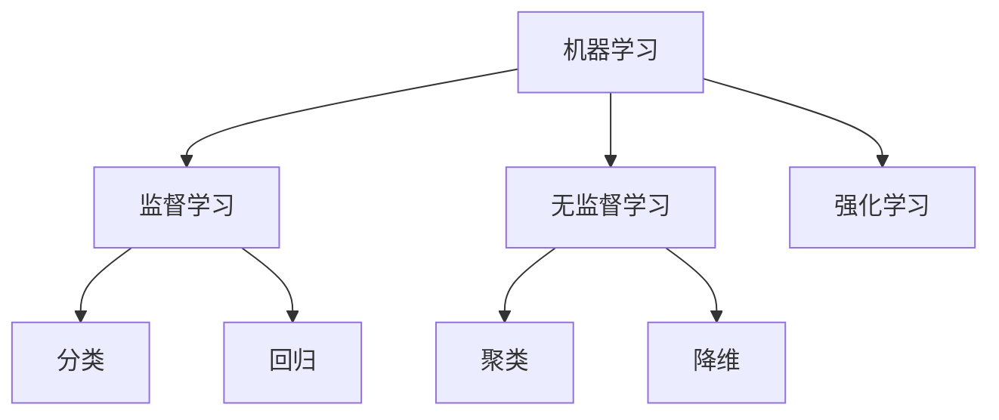

# 《机器学习》

**作者**: 周志华  
**出版年份**: 2016  
**阅读状态**: #已完成  
**标签**: #机器学习 #西瓜书 #中文教材 #算法原理  
**评分**: ⭐⭐⭐⭐⭐

---

## 📖 书籍概述

被誉为"西瓜书"的机器学习中文经典教材，以西瓜识别为例贯穿全书，系统介绍机器学习的基本概念、原理和方法。

## 🍉 西瓜例子的妙用

书中巧妙地以"西瓜好坏判断"为例子，将抽象的机器学习概念具体化：
- **特征**: 色泽、根蒂、敲声、纹理等
- **标签**: 好瓜、坏瓜
- **数据集**: 西瓜数据表

## 🎯 核心知识体系

### 三大学习任务


### 重要算法梳理
- [[决策树]]: ID3, C4.5, CART
- [[神经网络]]: 感知机, BP算法, RBF
- [[支持向量机]]: 线性SVM, 核技巧, SMO算法
- [[贝叶斯分类器]]: 朴素贝叶斯, 半朴素贝叶斯

## 📝 章节精华

### 第3章: 线性模型
**线性回归**: $f(x) = w^T x + b$
- 最小二乘法的几何意义
- 正则化: Ridge回归 vs Lasso回归
- 广义线性模型的对数几率回归

### 第4章: 决策树
**信息增益**: $\text{Gain}(D,a) = \text{Ent}(D) - \sum_{v=1}^V \frac{|D^v|}{|D|} \text{Ent}(D^v)$
- 信息熵的计算与理解
- 剪枝策略：预剪枝 vs 后剪枝
- 连续值处理与缺失值处理

### 第6章: 支持向量机
**优化目标**: 
$$\min_{w,b} \frac{1}{2}||w||^2 + C\sum_{i=1}^m \xi_i$$
- 几何间隔与函数间隔
- 核函数的选择策略
- 软间隔与硬间隔的权衡

## 💡 重要概念深析

### 偏差-方差分解
$$E(f;D) = \text{bias}^2(x) + \text{var}(x) + \varepsilon^2$$

- **偏差**: 算法本身的拟合能力
- **方差**: 数据扰动造成的影响  
- **噪声**: 数据本身的质量

### 过拟合与欠拟合
```
欠拟合 ←→ 恰好拟合 ←→ 过拟合
高偏差     低偏差低方差    高方差
```

## 🔗 知识网络

- [[交叉验证]]
- [[集成学习]]  
- [[特征选择]]
- [[降维算法]]
- [[聚类分析]]

## 🧮 数学推导笔记

### BP算法推导
设损失函数为 $E = \frac{1}{2}\sum_k(y_k - o_k)^2$

对权重的偏导数：
$$\frac{\partial E}{\partial w_{hj}} = \frac{\partial E}{\partial net_j} \cdot \frac{\partial net_j}{\partial w_{hj}} = \delta_j \cdot b_h$$

其中 $\delta_j = o_j(1-o_j)(y_j-o_j)$ 为输出层误差项

## 📊 算法对比分析

| 算法 | 优点 | 缺点 | 适用场景 |
|------|------|------|----------|
| 决策树 | 可解释性强 | 容易过拟合 | 分类任务 |
| SVM | 泛化能力强 | 参数选择困难 | 高维数据 |
| 神经网络 | 表达能力强 | 训练时间长 | 复杂模式 |
| 朴素贝叶斯 | 计算简单 | 独立性假设 | 文本分类 |

## 💭 学习心得

1. **数学基础重要性**: 深入理解算法需要扎实的数学功底
2. **实践与理论结合**: 西瓜例子帮助理解抽象概念
3. **中文表达优势**: 概念阐述更符合中文思维习惯

## 🎯 知识应用

### 已实现项目
- [x] **决策树分类器**: 基于信息增益的实现
- [x] **线性回归模型**: 梯度下降优化
- [x] **K-means聚类**: 西瓜数据集分析

### 待深入学习
- [ ] **集成学习**: AdaBoost和随机森林
- [ ] **降维算法**: PCA的数学原理
- [ ] **核方法**: 理解核函数的本质

## 📚 配套资源

- **课后习题**: 每章都有理论推导题
- **数据集**: 西瓜数据集3.0
- **在线资源**: 作者维护的勘误表

---

**阅读完成日期**: 2025-06-20  
**重读次数**: 2次  
**推荐程度**: 🌟 中文机器学习入门首选