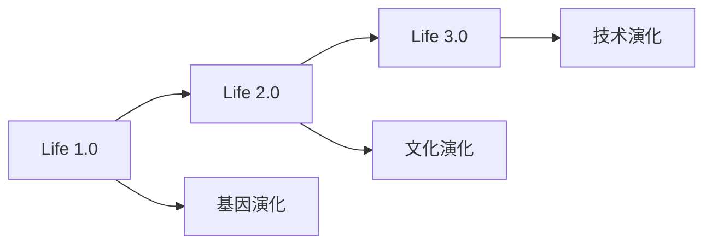

# 《生命3.0》

**作者**: Max Tegmark  
**出版年份**: 2017  
**阅读状态**: #已完成  
**标签**: #AI安全 #技术奇点 #未来学 #意识研究  
**评分**: ⭐⭐⭐⭐⭐

---

## 📖 书籍概述

MIT物理学家对人工智能未来的深度思考，从生命演化的角度分析AI发展，探讨人类文明的终极命运。既有科学严谨性，又富有哲学思辨色彩。

## 🧬 生命的三个阶段

### Life 1.0: 生物阶段
- **特征**: 硬件和软件都是演化而来
- **代表**: 细菌等简单生物
- **学习能力**: 仅限遗传进化

### Life 2.0: 文化阶段  
- **特征**: 硬件演化，软件可设计
- **代表**: 人类
- **学习能力**: 文化传承，知识积累

### Life 3.0: 技术阶段
- **特征**: 硬件和软件都可设计
- **代表**: 高级AI系统
- **学习能力**: 自我重新设计



## 🚀 AI发展的关键节点

### 当前阶段: 窄AI (ANI)
- **能力**: 特定任务超越人类
- **例子**: [[AlphaGo]], 语音识别, 图像分类
- **局限**: 缺乏通用性

### 下一阶段: 通用AI (AGI)
- **定义**: 在几乎所有认知任务上匹敌人类
- **时间预测**: 2030-2070年 (专家调查)
- **影响**: 社会结构根本性改变

### 终极阶段: 超级AI (ASI)
- **能力**: 在所有领域远超人类
- **时间线**: AGI出现后数年到数十年
- **风险**: 可能的存在风险

## 🎯 AI安全的核心问题

### 控制问题 (Control Problem)
> "如何确保AI系统按照我们的意图行事？"

**挑战**:
- **目标错位**: AI优化错误的目标函数
- **奖励破解**: 系统找到意外的方式获得奖励
- **分布偏移**: 训练环境与部署环境不同

### 价值对齐问题 (Value Alignment)
```
人类价值 → 机器理解 → 行为实现
    ↑         ↑         ↑
  复杂模糊   翻译困难   执行偏差
```

## 💭 意识与智能的哲学思考

### 意识的信息整合理论 (IIT)
**核心观点**: 意识对应于信息的整合程度

**量化指标**: Φ (Phi) 值
- 测量系统内信息整合的程度
- 高Φ值 = 高意识水平

### 意识的可计算性
**问题**: 机器能否具有真正的主观体验？

**观点对比**:
- **功能主义**: 实现相同功能即有意识
- **生物自然主义**: 意识需要特定生物基质
- **整合信息论**: 基于信息整合程度

## 🔮 未来场景分析

### 12种可能的AI未来

| 场景类型 | 人类角色 | AI角色 | 可能性评估 |
|----------|----------|--------|------------|
| 解放者乌托邦 | 受益者 | 仁慈统治者 | 中等 |
| 征服者反乌托邦 | 奴隶/灭绝 | 恶意统治者 | 低但后果严重 |
| 看门人 | 主导者 | 工具 | 较高 |
| 保护神 | 受保护者 | 监护者 | 中等 |
| 自由主义乌托邦 | 平等参与者 | 合作伙伴 | 理想但困难 |

### 宇宙尺度的思考
**费米悖论的AI解释**:
- 文明发展到AI阶段后自我毁灭？
- 超级AI选择隐藏自己？
- 智能文明转向内向发展？

## 🛡️ AI安全研究方向

### 技术安全
1. **可解释AI**: 让AI决策过程透明化
2. **鲁棒性**: 在对抗性攻击下保持稳定
3. **验证与测试**: 形式化验证AI系统

### 治理安全  
1. **国际合作**: AI发展的全球协调
2. **监管框架**: 平衡创新与安全
3. **伦理准则**: AI开发的道德约束

## 📊 关键统计数据

### 专家预测 (2016年调查)
- **AGI实现时间**: 50%概率在2040-2050年
- **ASI出现**: AGI后2-30年
- **正面影响概率**: ~50%
- **负面影响概率**: ~25%
- **存在风险**: ~5-10%

### 投资趋势
```
AI安全研究资金 << AI能力研究资金
```
这种不平衡需要引起重视。

## 🔗 相关概念网络

- [[AI对齐]]
- [[机器意识]]
- [[技术奇点]]
- [[存在风险]]
- [[未来主义]]

## 💡 对AI从业者的启示

### 技术责任
1. **长远思维**: 考虑技术的长期影响
2. **安全优先**: 在能力与安全间找平衡
3. **跨学科合作**: AI+伦理+哲学+政策

### 研究方向
- **可解释性**: 让AI系统更透明
- **鲁棒性**: 提高系统的可靠性
- **价值学习**: 让AI学习人类价值观

## 🎯 行动建议

### 个人层面
- [ ] **技能拓展**: 学习AI安全相关知识
- [ ] **伦理思考**: 思考技术的道德影响
- [ ] **参与讨论**: 加入AI治理对话

### 行业层面
- [ ] **安全研究**: 增加AI安全投入
- [ ] **标准制定**: 参与行业标准制定
- [ ] **国际合作**: 推动全球AI治理

## 📚 延伸阅读

1. 《Superintelligence》- Nick Bostrom
2. 《Human Compatible》- Stuart Russell  
3. 《The Alignment Problem》- Brian Christian
4. 《Weapons of Math Destruction》- Cathy O'Neil

## 🎬 相关媒体

- **播客**: Sam Harris访谈Max Tegmark
- **视频**: TED演讲"How to get empowered, not overpowered, by AI"
- **纪录片**: "The Age of AI" (YouTube Originals)

## 💭 个人思考

### 读后感悟
1. **宏观视野**: 从宇宙演化角度看AI发展
2. **urgency感**: AI安全不是遥远的问题
3. **复杂性**: 技术发展的不确定性

### 关键问题
- 我们能否在AGI到来前解决对齐问题？
- 技术发展的速度是否超过了治理能力？
- 人类文明如何在AI时代保持意义？

---

**阅读完成日期**: 2025-04-15  
**影响程度**: 🌟🌟🌟🌟🌟 深刻改变对AI的认知  
**推荐对象**: 所有AI从业者必读