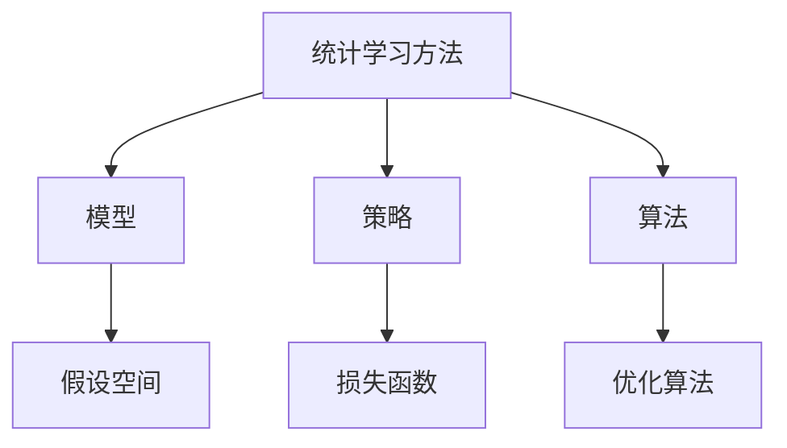

# 《统计学习方法》

**作者**: 李航  
**出版年份**: 2019 (第2版)  
**阅读状态**: #正在阅读  
**标签**: #统计学习 #机器学习理论 #算法实现 #数学推导  
**评分**: ⭐⭐⭐⭐⭐

---

## 📖 书籍概述

机器学习领域的经典教材，以统计学习理论为基础，系统介绍了主要的机器学习算法。数学推导严谨，适合深入理解算法本质。

## 🎯 统计学习三要素

### 方法 = 模型 + 策略 + 算法



### 核心思想
- **模型**: 学习什么样的条件概率分布或决策函数
- **策略**: 按照什么准则学习或选择最优模型
- **算法**: 用什么计算方法求解最优模型

## 📝 算法详解

### 第2章: 感知机
**模型**: $f(x) = \text{sign}(w \cdot x + b)$

**几何解释**: 
- 线性分类器在特征空间中对应一个超平面
- 感知机学习的目标是找到将正负实例分开的分离超平面

**算法实现**:
```python
def perceptron_learning(X, y, learning_rate=1.0):
    w = np.zeros(X.shape[1])
    b = 0
    
    while True:
        misclassified = False
        for i in range(len(X)):
            if y[i] * (np.dot(w, X[i]) + b) <= 0:
                w += learning_rate * y[i] * X[i]
                b += learning_rate * y[i]
                misclassified = True
        
        if not misclassified:
            break
    
    return w, b
```

### 第6章: 逻辑斯蒂回归
**模型**: $P(Y=1|x) = \frac{\exp(w \cdot x + b)}{1 + \exp(w \cdot x + b)}$

**参数估计**: 极大似然估计
$$L(w) = \sum_{i=1}^N [y_i \log \pi(x_i) + (1-y_i) \log(1-\pi(x_i))]$$

**优化算法**: 梯度下降、牛顿法

### 第7章: 支持向量机
**原问题**: 
$$\min_{w,b} \frac{1}{2}||w||^2$$
$$\text{s.t. } y_i(w \cdot x_i + b) \geq 1, i=1,2,...,N$$

**对偶问题**:
$$\max_{\alpha} \sum_{i=1}^N \alpha_i - \frac{1}{2}\sum_{i=1}^N \sum_{j=1}^N \alpha_i \alpha_j y_i y_j (x_i \cdot x_j)$$

## 💡 核心概念深入

### 泛化误差界
**PAC学习框架**下的泛化误差界：
$$R(f) \leq \hat{R}(f) + \sqrt{\frac{\log(2/\delta)}{2m}}$$

其中：
- $R(f)$: 期望风险  
- $\hat{R}(f)$: 经验风险
- $m$: 样本数量
- $\delta$: 置信水平

### VC维理论
**定义**: 能够被假设空间"打散"的最大点集的大小

**意义**: 
- 衡量假设空间的复杂度
- 确定泛化误差界
- 指导模型选择

## 📊 算法比较分析

| 算法 | 模型复杂度 | 训练复杂度 | 适用数据 | 可解释性 |
|------|------------|------------|----------|----------|
| 感知机 | O(n) | O(mn) | 线性可分 | 高 |
| 朴素贝叶斯 | O(n) | O(mn) | 特征独立 | 高 |
| 决策树 | O(n^k) | O(mn log n) | 任意 | 高 |
| SVM | O(m) | O(m³) | 高维稀疏 | 中 |
| 神经网络 | O(∞) | 复杂 | 大规模 | 低 |

## 🔍 数学推导笔记

### AdaBoost算法推导
**指数损失函数**: $L(y, f(x)) = \exp(-yf(x))$

**前向分步算法**:
$$f_m(x) = f_{m-1}(x) + \alpha_m G_m(x)$$

**权重更新公式**:
$$w_{m+1,i} = \frac{w_{m,i}}{Z_m} \exp(-\alpha_m y_i G_m(x_i))$$

其中 $Z_m$ 是规范化因子，$\alpha_m$ 是基学习器权重。

### EM算法数学基础
**目标**: 最大化对数似然 $\ell(\theta) = \log P(Y|\theta)$

**E步**: 求Q函数
$$Q(\theta, \theta^{(i)}) = E_{Z|Y,\theta^{(i)}}[\log P(Y,Z|\theta)]$$

**M步**: 最大化Q函数
$$\theta^{(i+1)} = \arg\max_\theta Q(\theta, \theta^{(i)})$$

## 🔗 相关概念链接

- [[凸优化]]
- [[概率论基础]]
- [[线性代数]]
- [[信息论]]
- [[计算复杂度]]

## 💭 学习心得

### 理论价值
1. **数学严谨性**: 每个算法都有完整的理论分析
2. **统一框架**: 用统计学习理论统一理解各种算法
3. **深度理解**: 不仅知其然，更知其所以然

### 实践指导
1. **算法选择**: 基于理论分析选择合适算法
2. **参数调优**: 理解参数对模型的影响
3. **性能评估**: 运用理论分析预测算法表现

## 🎯 学习计划

### 已完成章节
- [x] 第1章: 统计学习方法概论
- [x] 第2章: 感知机  
- [x] 第3章: k近邻法
- [x] 第4章: 朴素贝叶斯法
- [x] 第5章: 决策树

### 进行中
- [ ] 第6章: 逻辑斯蒂回归与最大熵模型
- [ ] 第7章: 支持向量机

### 待学习
- [ ] 第8章: 提升方法
- [ ] 第9章: EM算法及其推广
- [ ] 第10章: 隐马尔可夫模型

## 📚 配套学习资源

- **习题解答**: GitHub上的开源解答
- **代码实现**: 从零实现各个算法
- **相关论文**: 每章末尾的参考文献

## 🧮 编程实践

### 实现进度
- [x] **感知机**: NumPy实现，包含对偶形式
- [x] **k-NN**: 使用KD树优化搜索
- [ ] **SVM**: SMO算法实现
- [ ] **AdaBoost**: 集成多个弱分类器

---

**开始阅读日期**: 2025-07-01  
**最后更新**: 2025-08-17  
**学习强度**: 🔥🔥🔥🔥⚪ 高强度理论学习