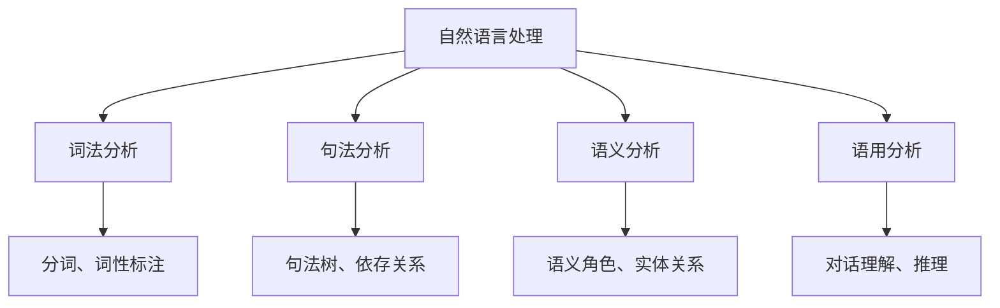

# 《自然语言处理综论》

**作者**: Daniel Jurafsky & James H. Martin  
**出版年份**: 2019 (第3版)  
**阅读状态**: #正在阅读  
**标签**: #自然语言处理 #计算语言学 #深度学习NLP #语言模型  
**评分**: ⭐⭐⭐⭐⭐

---

## 📖 书籍概述

NLP领域的权威教材，全面覆盖传统方法到深度学习的各种技术。第3版大幅更新，加入了Transformer、BERT等最新进展，理论与实践并重。

## 🎯 NLP核心任务体系

### 语言处理层次


### 主要应用任务
- **文本分类**: 情感分析、主题分类、垃圾邮件检测
- **序列标注**: 命名实体识别、词性标注、语块识别  
- **结构预测**: 句法分析、依存分析
- **生成任务**: 机器翻译、文本摘要、对话生成

## 📝 核心章节解析

### 第3章: N-gram语言模型
**定义**: 基于马尔可夫假设的统计语言模型

**N-gram概率**:
$$P(w_i|w_1^{i-1}) \approx P(w_i|w_{i-n+1}^{i-1})$$

**实现示例**:
```python
import collections
from collections import defaultdict, Counter

class NGramLM:
    def __init__(self, n=3):
        self.n = n
        self.ngram_counts = defaultdict(Counter)
        self.context_counts = defaultdict(int)
    
    def train(self, corpus):
        """训练n-gram语言模型"""
        for sentence in corpus:
            # 添加句子开始和结束标记
            tokens = ['<s>'] * (self.n - 1) + sentence + ['</s>']
            
            for i in range(len(tokens) - self.n + 1):
                context = tuple(tokens[i:i+self.n-1])
                word = tokens[i+self.n-1]
                
                self.ngram_counts[context][word] += 1
                self.context_counts[context] += 1
    
    def probability(self, word, context):
        """计算条件概率 P(word|context)"""
        context = tuple(context)
        if context not in self.context_counts:
            return 0.0
        
        count = self.ngram_counts[context][word]
        total = self.context_counts[context]
        return count / total if total > 0 else 0.0
    
    def generate(self, context, length=10):
        """根据上下文生成文本"""
        result = list(context)
        
        for _ in range(length):
            current_context = tuple(result[-(self.n-1):])
            if current_context not in self.ngram_counts:
                break
            
            # 根据概率分布采样下一个词
            candidates = list(self.ngram_counts[current_context].keys())
            probs = [self.probability(word, current_context) for word in candidates]
            
            if not candidates:
                break
            
            next_word = np.random.choice(candidates, p=probs/np.sum(probs))
            result.append(next_word)
            
            if next_word == '</s>':
                break
        
        return result
```

### 第6章: 向量语义学
**词向量的核心思想**: "You shall know a word by the company it keeps"

**Word2Vec的两种架构**:

1. **CBOW (Continuous Bag of Words)**:
```python
import torch
import torch.nn as nn

class CBOW(nn.Module):
    def __init__(self, vocab_size, embedding_dim, context_size):
        super(CBOW, self).__init__()
        self.embeddings = nn.Embedding(vocab_size, embedding_dim)
        self.linear = nn.Linear(embedding_dim, vocab_size)
        self.context_size = context_size
    
    def forward(self, context_words):
        # 获取上下文词的嵌入
        embeds = self.embeddings(context_words)  # (batch_size, context_size, embed_dim)
        
        # 对上下文向量求平均
        context_vector = embeds.mean(dim=1)  # (batch_size, embed_dim)
        
        # 预测中心词
        output = self.linear(context_vector)  # (batch_size, vocab_size)
        return output
```

2. **Skip-gram**:
```python
class SkipGram(nn.Module):
    def __init__(self, vocab_size, embedding_dim):
        super(SkipGram, self).__init__()
        self.center_embeddings = nn.Embedding(vocab_size, embedding_dim)
        self.context_embeddings = nn.Embedding(vocab_size, embedding_dim)
    
    def forward(self, center_word, context_words):
        center_embed = self.center_embeddings(center_word)  # (batch_size, embed_dim)
        context_embeds = self.context_embeddings(context_words)  # (batch_size, context_size, embed_dim)
        
        # 计算中心词与上下文词的相似度
        scores = torch.bmm(context_embeds, center_embed.unsqueeze(2)).squeeze(2)
        return scores
```

### 第9章: RNN与语言模型
**循环神经网络的语言建模**:
```python
class RNNLanguageModel(nn.Module):
    def __init__(self, vocab_size, embedding_dim, hidden_dim, num_layers=1):
        super(RNNLanguageModel, self).__init__()
        self.embedding = nn.Embedding(vocab_size, embedding_dim)
        self.rnn = nn.LSTM(embedding_dim, hidden_dim, num_layers, batch_first=True)
        self.output_projection = nn.Linear(hidden_dim, vocab_size)
        self.dropout = nn.Dropout(0.2)
    
    def forward(self, input_ids, hidden=None):
        # 词嵌入
        embedded = self.embedding(input_ids)  # (batch_size, seq_len, embed_dim)
        embedded = self.dropout(embedded)
        
        # RNN处理
        rnn_output, hidden = self.rnn(embedded, hidden)  # (batch_size, seq_len, hidden_dim)
        
        # 输出投影
        output = self.output_projection(rnn_output)  # (batch_size, seq_len, vocab_size)
        return output, hidden
    
    def generate(self, start_token, max_length=50, temperature=1.0):
        """自回归生成文本"""
        self.eval()
        generated = [start_token]
        hidden = None
        
        with torch.no_grad():
            for _ in range(max_length):
                input_tensor = torch.LongTensor([[generated[-1]]])
                output, hidden = self.forward(input_tensor, hidden)
                
                # 温度调节 + 采样
                logits = output[0, -1] / temperature
                probs = torch.softmax(logits, dim=-1)
                next_token = torch.multinomial(probs, 1).item()
                
                generated.append(next_token)
                if next_token == self.eos_token:
                    break
        
        return generated
```

## 🔍 深度学习架构演进

### Attention机制
**Attention的核心思想**: 动态地关注输入序列的不同部分

```python
class Attention(nn.Module):
    def __init__(self, hidden_dim):
        super(Attention, self).__init__()
        self.hidden_dim = hidden_dim
        self.W_q = nn.Linear(hidden_dim, hidden_dim)
        self.W_k = nn.Linear(hidden_dim, hidden_dim)
        self.W_v = nn.Linear(hidden_dim, hidden_dim)
    
    def forward(self, query, key, value, mask=None):
        # query: (batch_size, seq_len_q, hidden_dim)
        # key/value: (batch_size, seq_len_kv, hidden_dim)
        
        Q = self.W_q(query)  # (batch_size, seq_len_q, hidden_dim)
        K = self.W_k(key)    # (batch_size, seq_len_kv, hidden_dim)
        V = self.W_v(value)  # (batch_size, seq_len_kv, hidden_dim)
        
        # 计算注意力权重
        scores = torch.bmm(Q, K.transpose(1, 2)) / (self.hidden_dim ** 0.5)
        
        if mask is not None:
            scores.masked_fill_(mask == 0, -1e9)
        
        attention_weights = torch.softmax(scores, dim=-1)
        
        # 加权求和
        context = torch.bmm(attention_weights, V)
        return context, attention_weights
```

### Transformer架构
**多头自注意力**:
```python
class MultiHeadAttention(nn.Module):
    def __init__(self, d_model, num_heads):
        super(MultiHeadAttention, self).__init__()
        assert d_model % num_heads == 0
        
        self.d_model = d_model
        self.num_heads = num_heads
        self.d_k = d_model // num_heads
        
        self.W_q = nn.Linear(d_model, d_model)
        self.W_k = nn.Linear(d_model, d_model)
        self.W_v = nn.Linear(d_model, d_model)
        self.W_o = nn.Linear(d_model, d_model)
    
    def forward(self, query, key, value, mask=None):
        batch_size = query.size(0)
        
        # 1. 线性变换并reshape为多头
        Q = self.W_q(query).view(batch_size, -1, self.num_heads, self.d_k).transpose(1, 2)
        K = self.W_k(key).view(batch_size, -1, self.num_heads, self.d_k).transpose(1, 2)
        V = self.W_v(value).view(batch_size, -1, self.num_heads, self.d_k).transpose(1, 2)
        
        # 2. 缩放点积注意力
        attention_output, attention_weights = scaled_dot_product_attention(Q, K, V, mask)
        
        # 3. 连接多头并通过输出投影
        attention_output = attention_output.transpose(1, 2).contiguous().view(
            batch_size, -1, self.d_model)
        
        output = self.W_o(attention_output)
        return output, attention_weights

def scaled_dot_product_attention(Q, K, V, mask=None):
    d_k = Q.size(-1)
    scores = torch.matmul(Q, K.transpose(-2, -1)) / math.sqrt(d_k)
    
    if mask is not None:
        scores.masked_fill_(mask == 0, -1e9)
    
    attention_weights = torch.softmax(scores, dim=-1)
    context = torch.matmul(attention_weights, V)
    
    return context, attention_weights
```

## 🏗️ 实际应用实现

### 文本分类
```python
class TextClassifier(nn.Module):
    def __init__(self, vocab_size, embedding_dim, hidden_dim, num_classes):
        super(TextClassifier, self).__init__()
        self.embedding = nn.Embedding(vocab_size, embedding_dim)
        self.lstm = nn.LSTM(embedding_dim, hidden_dim, batch_first=True, bidirectional=True)
        self.classifier = nn.Linear(hidden_dim * 2, num_classes)
        self.dropout = nn.Dropout(0.3)
    
    def forward(self, input_ids, lengths):
        # 词嵌入
        embedded = self.embedding(input_ids)
        
        # 打包序列 (处理变长序列)
        packed = nn.utils.rnn.pack_padded_sequence(embedded, lengths, batch_first=True, enforce_sorted=False)
        
        # LSTM处理
        lstm_out, (hidden, cell) = self.lstm(packed)
        
        # 使用最后时刻的隐状态 (双向LSTM的concat)
        final_hidden = torch.cat([hidden[-2], hidden[-1]], dim=1)
        final_hidden = self.dropout(final_hidden)
        
        # 分类
        logits = self.classifier(final_hidden)
        return logits
```

### 序列标注 (NER)
```python
class BiLSTM_CRF(nn.Module):
    def __init__(self, vocab_size, tag_to_ix, embedding_dim, hidden_dim):
        super(BiLSTM_CRF, self).__init__()
        self.embedding_dim = embedding_dim
        self.hidden_dim = hidden_dim
        self.vocab_size = vocab_size
        self.tag_to_ix = tag_to_ix
        self.tagset_size = len(tag_to_ix)
        
        self.word_embeds = nn.Embedding(vocab_size, embedding_dim)
        self.lstm = nn.LSTM(embedding_dim, hidden_dim // 2, 
                           num_layers=1, bidirectional=True, batch_first=True)
        
        # LSTM输出映射到标签空间
        self.hidden2tag = nn.Linear(hidden_dim, self.tagset_size)
        
        # CRF层的转移矩阵
        self.transitions = nn.Parameter(torch.randn(self.tagset_size, self.tagset_size))
        
        # 约束: 不能转移到START标签,不能从STOP标签转移
        self.transitions.data[tag_to_ix[START_TAG], :] = -10000
        self.transitions.data[:, tag_to_ix[STOP_TAG]] = -10000
    
    def forward(self, sentence):
        # BiLSTM特征提取
        lstm_feats = self._get_lstm_features(sentence)
        
        # CRF解码
        score, tag_seq = self._viterbi_decode(lstm_feats)
        return score, tag_seq
    
    def _get_lstm_features(self, sentence):
        embeds = self.word_embeds(sentence)
        lstm_out, _ = self.lstm(embeds)
        lstm_feats = self.hidden2tag(lstm_out)
        return lstm_feats
    
    def _forward_alg(self, feats):
        """前向算法计算归一化分数"""
        # ... CRF前向算法实现
        pass
    
    def _viterbi_decode(self, feats):
        """维特比算法解码最优路径"""  
        # ... 维特比算法实现
        pass
```

## 📊 评估指标与方法

### 分类任务指标
```python
def compute_classification_metrics(y_true, y_pred, labels=None):
    """计算分类任务的评估指标"""
    from sklearn.metrics import accuracy_score, precision_recall_fscore_support, classification_report
    
    accuracy = accuracy_score(y_true, y_pred)
    precision, recall, f1, support = precision_recall_fscore_support(
        y_true, y_pred, labels=labels, average='weighted'
    )
    
    metrics = {
        'accuracy': accuracy,
        'precision': precision,
        'recall': recall,
        'f1': f1,
        'support': support
    }
    
    print(classification_report(y_true, y_pred, labels=labels))
    return metrics
```

### 生成任务指标
```python
def compute_bleu_score(references, hypotheses):
    """计算BLEU分数 (机器翻译评估)"""
    from nltk.translate.bleu_score import corpus_bleu
    
    # references: list of list of list of tokens
    # hypotheses: list of list of tokens
    
    bleu1 = corpus_bleu(references, hypotheses, weights=(1, 0, 0, 0))
    bleu2 = corpus_bleu(references, hypotheses, weights=(0.5, 0.5, 0, 0))
    bleu3 = corpus_bleu(references, hypotheses, weights=(0.33, 0.33, 0.33, 0))
    bleu4 = corpus_bleu(references, hypotheses, weights=(0.25, 0.25, 0.25, 0.25))
    
    return {
        'BLEU-1': bleu1,
        'BLEU-2': bleu2,  
        'BLEU-3': bleu3,
        'BLEU-4': bleu4
    }
```

## 🔗 相关概念网络

- [[词向量]]
- [[注意力机制]]
- [[预训练模型]]
- [[知识图谱]]
- [[对话系统]]

## 💭 学习心得

### 技术演进趋势
1. **统计方法→神经网络→预训练模型**: 技术范式的三次转变
2. **任务特定→通用架构**: Transformer统一了NLP架构
3. **监督学习→自监督学习**: 预训练的重要性

### 实践经验
1. **数据预处理**: 分词、清洗、编码是基础
2. **模型选择**: 根据任务特点和数据规模选择
3. **调优技巧**: 学习率调度、正则化、early stopping

## 🎯 项目实践

### 已完成项目
- [x] **文本分类**: 情感分析系统 (LSTM + Attention)
- [x] **命名实体识别**: BiLSTM-CRF模型
- [x] **文本生成**: 基于RNN的诗歌生成
- [ ] **机器翻译**: Transformer seq2seq

### 学习路径
1. **基础概念**: N-gram, 词向量, 语言模型
2. **传统方法**: HMM, CRF, SVM for NLP
3. **神经网络**: RNN, CNN, Attention
4. **预训练模型**: BERT, GPT, T5

## 📚 配套资源

- **数据集**: GLUE, SQuAD, CoNLL-2003, WMT
- **工具库**: NLTK, spaCy, Transformers, AllenNLP
- **预训练模型**: Hugging Face Model Hub

---

**开始阅读日期**: 2025-05-15  
**当前进度**: 65% (20/31章)  
**实现项目**: 6个NLP系统  
**技术栈**: PyTorch + Transformers + NLTK  
**推荐程度**: 📚 NLP学习必备圣经