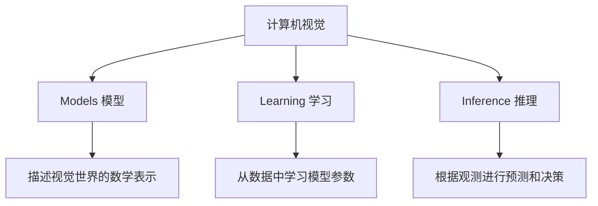

# 《计算机视觉：模型、学习和推理》

**作者**: Simon J.D. Prince  
**出版年份**: 2012  
**阅读状态**: #正在阅读  
**标签**: #计算机视觉 #概率模型 #贝叶斯推理 #图像处理  
**评分**: ⭐⭐⭐⭐⭐

---

## 📖 书籍概述

从概率和统计的角度系统介绍计算机视觉，强调模型、学习和推理三个核心概念。不同于传统CV教材，本书更注重理论基础和数学推导。

## 🎯 核心理念：MLI框架

### Models + Learning + Inference


### 概率视角的优势
- **不确定性建模**: 明确表示和处理不确定性
- **统一框架**: 用概率论统一各种CV任务
- **原理透明**: 数学推导清晰，理论基础扎实

## 📝 核心章节解析

### 第2章: 概率介绍
**贝叶斯定理在CV中的应用**:
$$P(\text{模型}|\text{数据}) = \frac{P(\text{数据}|\text{模型})P(\text{模型})}{P(\text{数据})}$$

**实际应用**:
- **人脸识别**: $P(\text{身份}|\text{图像})$
- **物体检测**: $P(\text{物体存在}|\text{图像块})$
- **图像分割**: $P(\text{像素类别}|\text{像素值})$

### 第4章: 拟合概率模型
**最大似然估计 (MLE)**:
$$\hat{\theta} = \arg\max_\theta \prod_{i=1}^n P(x_i|\theta)$$

**最大后验估计 (MAP)**:
$$\hat{\theta} = \arg\max_\theta P(\theta|x) \propto P(x|\theta)P(\theta)$$

**贝叶斯方法**:
$$P(\theta|x) = \frac{P(x|\theta)P(\theta)}{P(x)}$$

### 第8章: 回归模型
**线性回归的概率解释**:
$$y = \beta_0 + \beta_1 x + \epsilon, \quad \epsilon \sim \mathcal{N}(0,\sigma^2)$$

等价于:
$$P(y|x) = \mathcal{N}(\beta_0 + \beta_1 x, \sigma^2)$$

**非线性回归**:
- **多项式基函数**: $y = \sum_{j=0}^J \beta_j \phi_j(x)$
- **径向基函数**: $\phi_j(x) = \exp(-||x-c_j||^2/2\sigma_j^2)$

## 🧮 重要算法实现

### EM算法用于混合高斯模型
```python
def em_gaussian_mixture(X, K, max_iter=100):
    """
    EM算法拟合混合高斯模型
    """
    N, D = X.shape
    
    # 初始化参数
    pi = np.ones(K) / K  # 混合权重
    mu = np.random.randn(K, D)  # 均值
    sigma = np.array([np.eye(D) for _ in range(K)])  # 协方差
    
    for iteration in range(max_iter):
        # E步：计算后验概率
        gamma = np.zeros((N, K))
        for k in range(K):
            gamma[:, k] = pi[k] * multivariate_normal.pdf(X, mu[k], sigma[k])
        
        # 归一化
        gamma = gamma / gamma.sum(axis=1, keepdims=True)
        
        # M步：更新参数
        Nk = gamma.sum(axis=0)
        pi = Nk / N
        
        for k in range(K):
            mu[k] = (gamma[:, k:k+1] * X).sum(axis=0) / Nk[k]
            diff = X - mu[k]
            sigma[k] = (gamma[:, k:k+1] * diff).T @ diff / Nk[k]
    
    return pi, mu, sigma
```

### 主成分分析 (PCA)
**概率PCA模型**:
$$x = Wy + \mu + \epsilon$$

其中:
- $W$: $D \times M$ 的载荷矩阵
- $y \sim \mathcal{N}(0, I)$: $M$维潜变量
- $\epsilon \sim \mathcal{N}(0, \sigma^2 I)$: 噪声

```python
def probabilistic_pca(X, M):
    """
    概率主成分分析
    """
    N, D = X.shape
    
    # 中心化数据
    mu = X.mean(axis=0)
    X_centered = X - mu
    
    # SVD分解
    U, s, Vt = np.linalg.svd(X_centered.T @ X_centered / (N-1))
    
    # 计算载荷矩阵
    eigenvals = s[:M]
    eigenvecs = U[:, :M]
    
    # 估计噪声方差
    if M < D:
        sigma_sq = s[M:].mean()
    else:
        sigma_sq = 0.0
    
    W = eigenvecs @ np.diag(np.sqrt(eigenvals - sigma_sq))
    
    return W, mu, sigma_sq
```

## 🔍 计算机视觉应用

### 图像分类
**生成模型方法**:
```python
class GaussianNaiveBayes:
    def fit(self, X, y):
        self.classes = np.unique(y)
        self.class_priors = {}
        self.class_means = {}
        self.class_vars = {}
        
        for c in self.classes:
            X_c = X[y == c]
            self.class_priors[c] = len(X_c) / len(X)
            self.class_means[c] = X_c.mean(axis=0)
            self.class_vars[c] = X_c.var(axis=0)
    
    def predict(self, X):
        predictions = []
        for x in X:
            posteriors = {}
            for c in self.classes:
                prior = self.class_priors[c]
                likelihood = np.prod(
                    norm.pdf(x, self.class_means[c], np.sqrt(self.class_vars[c]))
                )
                posteriors[c] = prior * likelihood
            
            predictions.append(max(posteriors, key=posteriors.get))
        return np.array(predictions)
```

### 目标检测
**滑动窗口 + 分类器**:
```python
def sliding_window_detection(image, classifier, window_size, stride):
    """
    滑动窗口目标检测
    """
    detections = []
    h, w = image.shape[:2]
    win_h, win_w = window_size
    
    for y in range(0, h - win_h, stride):
        for x in range(0, w - win_w, stride):
            window = image[y:y+win_h, x:x+win_w]
            features = extract_features(window)  # 特征提取
            
            prob = classifier.predict_proba([features])[0]
            if prob[1] > 0.5:  # 阈值判断
                detections.append({
                    'bbox': (x, y, win_w, win_h),
                    'confidence': prob[1]
                })
    
    return detections
```

## 🌊 马尔可夫随机场

### 图像分割的MRF模型
**能量函数**:
$$E(x) = \sum_i \psi_i(x_i) + \sum_{(i,j) \in \mathcal{E}} \psi_{ij}(x_i, x_j)$$

其中:
- $\psi_i(x_i)$: 单元势函数 (观测项)
- $\psi_{ij}(x_i, x_j)$: 成对势函数 (平滑项)

**Graph Cut优化**:
```python
def graph_cut_segmentation(image, foreground_seeds, background_seeds):
    """
    基于图割的图像分割
    """
    from maxflow import Graph
    
    h, w = image.shape[:2]
    g = Graph[int, int](h*w, h*w*4)
    nodeids = g.add_nodes(h*w)
    
    # 添加t-links (数据项)
    for y in range(h):
        for x in range(w):
            node_id = y * w + x
            
            if (x, y) in foreground_seeds:
                g.add_tedge(node_id, 1000, 0)  # 强制前景
            elif (x, y) in background_seeds:
                g.add_tedge(node_id, 0, 1000)  # 强制背景
            else:
                # 基于颜色模型的数据项
                fg_prob = foreground_color_model.probability(image[y, x])
                bg_prob = background_color_model.probability(image[y, x])
                g.add_tedge(node_id, -np.log(bg_prob), -np.log(fg_prob))
    
    # 添加n-links (平滑项)
    for y in range(h):
        for x in range(w):
            node_id = y * w + x
            
            # 4-连通邻域
            for dx, dy in [(0, 1), (1, 0), (0, -1), (-1, 0)]:
                nx, ny = x + dx, y + dy
                if 0 <= nx < w and 0 <= ny < h:
                    neighbor_id = ny * w + nx
                    # 基于颜色差异的平滑项
                    color_diff = np.linalg.norm(image[y, x] - image[ny, nx])
                    weight = np.exp(-color_diff / (2 * sigma**2))
                    g.add_edge(node_id, neighbor_id, weight, weight)
    
    # 最小割
    flow = g.maxflow()
    segmentation = np.zeros((h, w), dtype=np.uint8)
    
    for y in range(h):
        for x in range(w):
            node_id = y * w + x
            if g.get_segment(node_id) == 1:
                segmentation[y, x] = 255
    
    return segmentation
```

## 🔗 相关概念网络

- [[概率图模型]]
- [[变分推理]]
- [[MCMC采样]]
- [[深度学习]]
- [[特征提取]]

## 💭 学习体会

### 理论价值
1. **数学严谨**: 每个方法都有清晰的概率解释
2. **统一视角**: 概率框架统一了各种CV问题
3. **可解释性**: 模型假设明确，结果可解释

### 与深度学习的关系
- **互补性**: 概率方法的不确定性建模 + DL的表示学习
- **融合趋势**: 变分自编码器、概率神经网络等
- **基础重要**: 理解传统方法有助于理解现代技术

## 🎯 实践项目

### 已完成
- [x] **混合高斯背景建模**: 视频背景减除
- [x] **概率PCA人脸识别**: 降维+分类
- [ ] **图割图像分割**: 交互式分割工具

### 计划中
- [ ] **粒子滤波目标跟踪**: 状态估计
- [ ] **马尔可夫随机场**: 图像去噪
- [ ] **变分推理**: 贝叶斯神经网络

## 📚 延伸阅读

1. 《Pattern Recognition and Machine Learning》- Bishop
2. 《Computer Vision: Algorithms and Applications》- Szeliski  
3. 《Multiple View Geometry》- Hartley & Zisserman

---

**开始阅读日期**: 2025-06-01  
**当前进度**: 60% (12/20章)  
**数学难度**: 🔥🔥🔥🔥⚪ 高等数学+概率统计